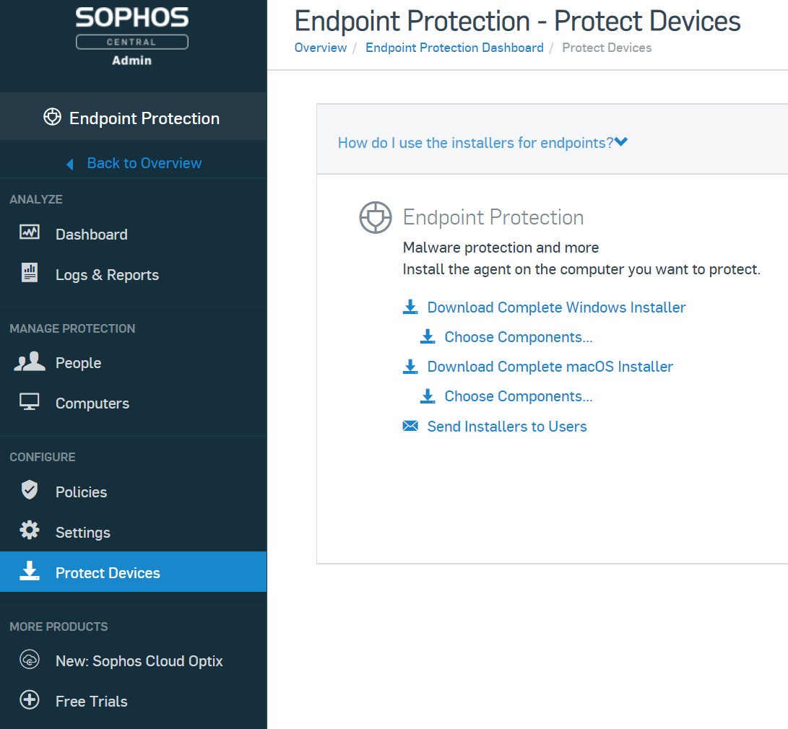
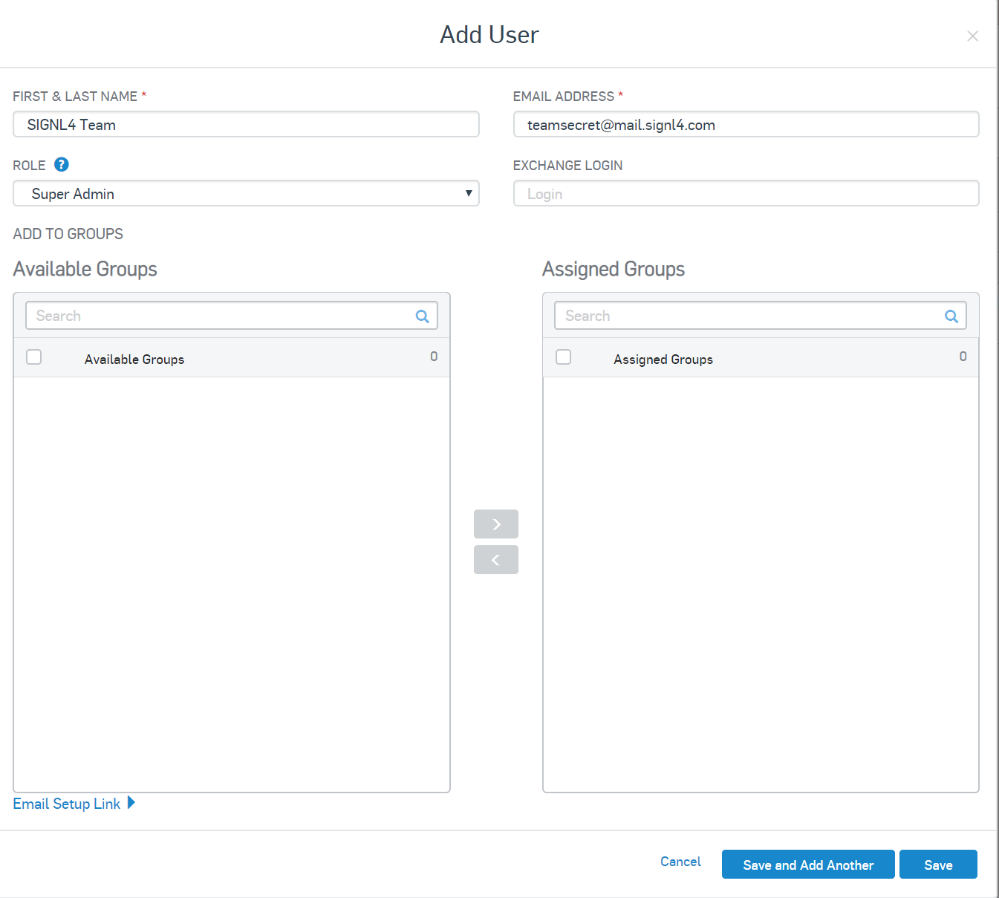
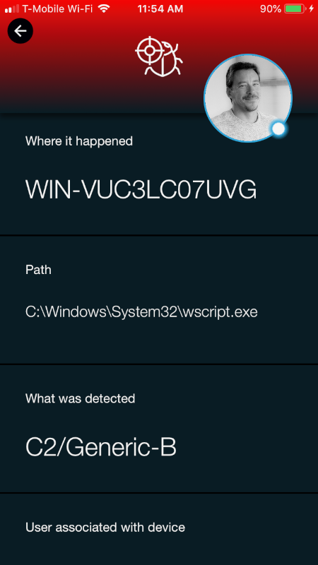
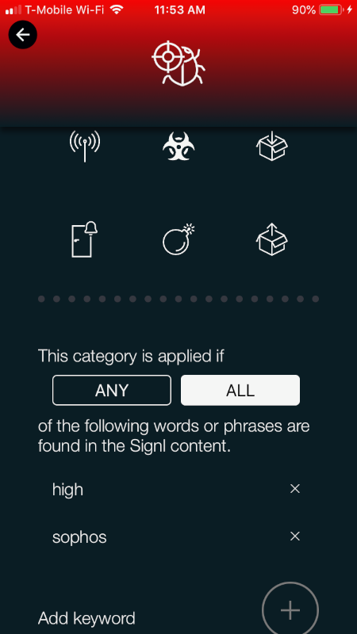

# SIGNL4 Integration with Sophos

In our example we are using Sophos to monitor critical servers for suspicious activity.  We are setting up a new user within Sophos with the SIGNL4 Team email address and will receive the alerts in real time.

SIGNL4 is a mobile alert notification app for powerful alerting, alert management and mobile assignment of work items.  Get the app at [https://www.signl4.com](https://www.signl4.com/)

## Prerequisites

- A SIGNL4 ([https://www.signl4.com](https://www.signl4.com/)) account
- Sophos ([https://www.sophos.com/](https://www.sophos.com/)) account

## How to integrate

Download the installer located in Configure > Protect Devices



Run the installer on the desired machine. In this case we used a local VM server.

On the Overview menu, select Global Settings > Configure Email Alerts

Create a new User and give that user the SIGNL4 Team email address. This will automatically set the "Receive Alerts" tab to YES.

Now lets generate some unwanted activity. Navigate to the following KB article [https://community.sophos.com/kb/en-us/10027](https://community.sophos.com/kb/en-us/10027)

- To test the Malicious Traffic Detection feature, do the following:
- Copy the following text and paste it into a text document:

```vb
set o = createobject("MSXML2.XMLHTTP")
o.open "GET", "http://sophostest.com/mtdtest/2/" & rnd, FALSE
o.send
```

- Name the file mtd.vbs.
- Double-click the file to trigger a detection.

If the MTD feature is active, you will receive a C2/generic-B detection on the endpoint. The Sophos Network Threat Protection feature must be installed for MTD to function. This is only available in Sophos Central and Sophos Enterprise Console with managed Sophos Endpoint 10.6.0 and above.

_Note: All of the files contained in this article should be used for testing purposes only._



SIGNL4 will now route the alert to the team member on-call and/or On Duty. Further augmentation should be done through the Systems and Services section to color code and categorize alerts.




