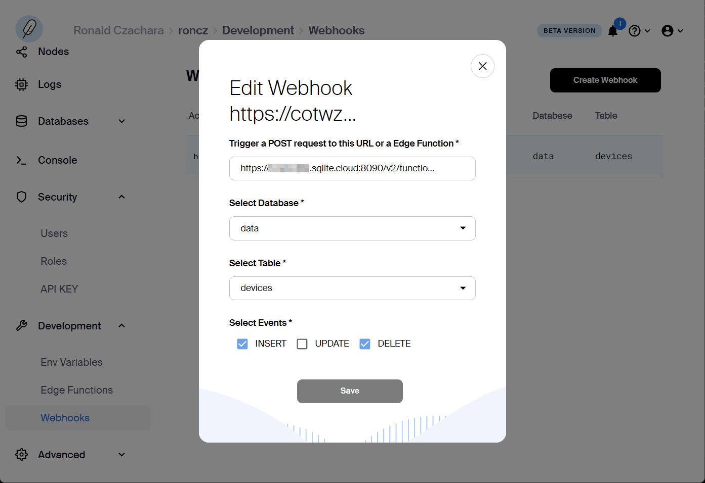
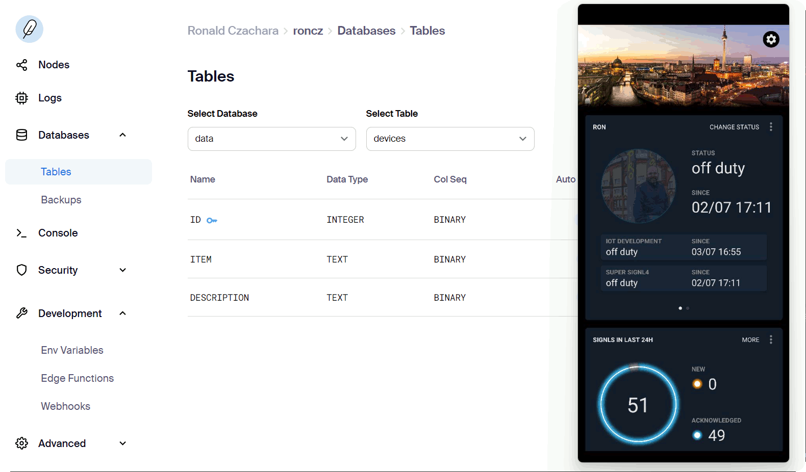

# SIGNL4 Integration with SQLite Cloud

In industry and production scenarios a lot of machine data is gathered. This includes the temperature of certain machines, time spans of certain processes, system pressure, power consumption, vibration detection, etc. The data is (or can be made) available in database tables and sometimes it is already being displayed on dashboards on computer screens. In daily operations, it is hard to look at each relevant dashboard all the time. Therefore, it makes sense to send relevant information about critical situations to the responsible users in real time no matter where they are. That is where SIGNL4 comes in.

Integrating SIGNL4 with any database can enhance your daily operations with an extension to your mobile team in the field or on the shop floor.

Gathering information from a database and sending team alerts in case of critical incidents is achieved with a simple script. In our case we use a PHP script that connect to the database, executes an SQL Select statement and sends an alert via SIGNL4 if necessary.

SIGNL4 is a mobile alert notification app for powerful alerting, alert management and for mobile assignment of work items. Get the app at [https://www.signl4.com](https://www.signl4.com/).

[SQLite Cloud](https://sqlitecloud.io/) is a distributed relational database system built on top of the SQLite database engine. It has been specifically designed from the ground up to ensure the strong consistency of your data across all nodes in a cluster, while simultaneously managing the technical aspects of scaling, security, and data distribution.

## Prerequisites

- A SIGNL4 ([https://www.signl4.com](https://www.signl4.com/)) account
- A [SQLite Cloud](https://sqlitecloud.io/) instance

## How to Integrate

In SQLite Cloud you need a database table, an edge function and a webhook that triggers the edge function whenever a new record is created or an existing one is deleted.

In our sample inserting a new record will trigger an alert and deleting a record will close the alert respectively.

### Database Table

In your database you need one or more tables containing your production data to trigger alerts on.

Out simple sample table looks like follows:

** Table: devices **
| ID | ITEM | DESCRIPTION                          |
|----|------|--------------------------------------|
| 1  | A2   | Malfunction on machine A2 in hall 1. |
| 2  | B1   | Maintenance request on conveyer 2.   |

Here is the SQL statement to create this table.

```sql
CREATE TABLE
  devices (
    ID INTEGER PRIMARY KEY AUTOINCREMENT,
    ITEM TEXT NOT NULL,
    DESCRIPTION TEXT NOT NULL
  )
```

### Edge Function

Create a new edge function for processing the insert or delete request and to send a SIGNL4 alert.

Here is the sample code:

```javascript
// Edge function sample for SIGNL4 alerting on new data sets.
// This code is triggered when a new record set is inserted or deleted into or from the DEVICES table.
// Inserting a record will trigger a SIGNL4 alert.
// Deleting a record will close the previously created alert in SIGNL4.

// This code uses the following sample table
/*
CREATE TABLE
  devices (
    ID INTEGER PRIMARY KEY AUTOINCREMENT,
    ITEM TEXT NOT NULL,
    DESCRIPTION TEXT NOT NULL
  )
*/

// Read environment variable and request data from the webhook
const signl4Secret = await connection.sql`GET ENV signl4_secret`;
const id = request.data?.data;

// Use the connect utility to execute SQL statements on the selected database
const result = await connection.sql`
    SELECT * FROM devices
    WHERE ID = ${id}
`;

// Build the object to be sent to SIGNL4 and to be returned by the edge function
let message = {};
if (result.length > 0) {
    message = result[0];
}
message["Title"] = "Alert from SQLite Cloud";
message["X-S4-ExternalID"] = "SQLite-Cloud-ID-" + id;
message["X-S4-SourceSystem"] = "SQLiteCloud";
if (request.data?.type == "delete") {
    // Close alert
    message["X-S4-Status"] = "resolved";
}
else {
    // Trigger alert
    message["X-S4-Status"] = "new";
}

// Send SIGNK4 alert (trigger or resolve)
let signl4WebhookEndpoint = "https://connect.signl4.com/webhook/" + signl4Secret;
try {
    await fetch(signl4WebhookEndpoint, { body: JSON.stringify(message), method: 'POST', 'Content-type': 'application/json'  });
} catch (err) {
    // Error
}

// Return the object from your edge function
return {
    data: {
        message,
        result,
        request
    }
};

```

### Webhook

Now, create a webhook that triggers the above edge function. You need to specify the webhook URL of the edge function accordingly.



## Test It

Now you can test the functionality by inserting or deleting a record. This will trigger and close an alert in SIGNL4.



Here are the sample SQL statements:

```sql
-- Insert record
INSERT INTO DEVICES (ITEM, DESCRIPTION) VALUES ("C1", "Malfunction on machine C1 in hall 1. Please check.")

-- Delete record
DELETE FROM DEVICES WHERE ITEM LIKE "C1"
```

You can adapt this scenario to match your needs, for example you can check to average data for a certain time frame or you can connect to other tools like Node-RED for creating more sophisticated workflows.

The alert in SIGNL4 might look like this.


