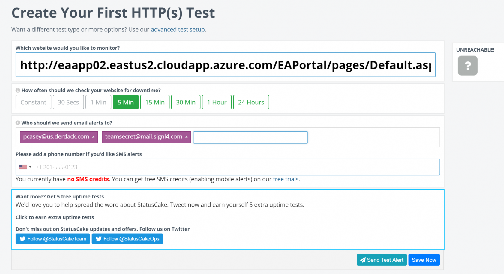
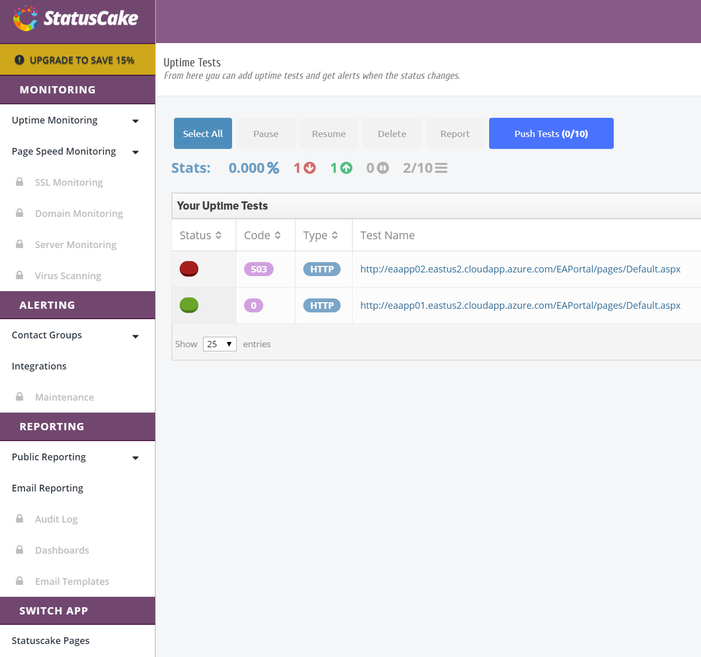
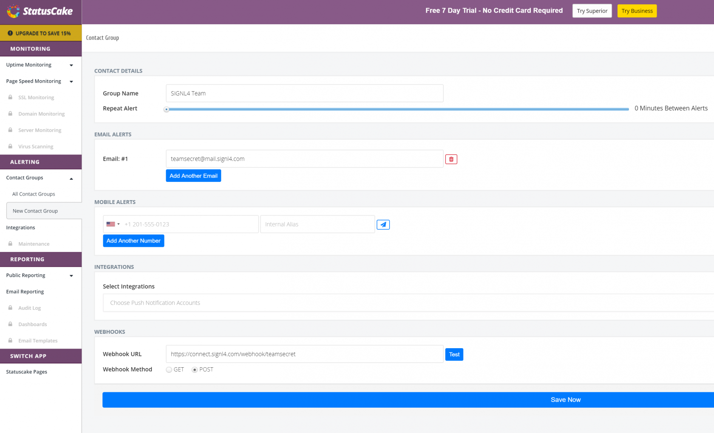
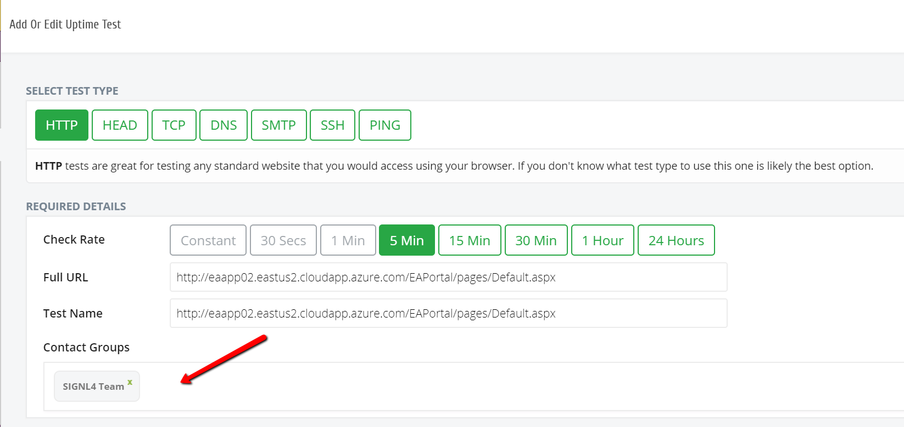

# SIGNL4 Integration with StatusCake

[StatusCake](https://www.statuscake.com/) is a cloud-based website, server and performance monitor with easy to configure dashboards and user setup.

In our example we are using StatusCake to monitor the up-time of critical servers. We are setting up a PING alert that will email the SIGNL4 team when a server is unreachable.

SIGNL4 is a mobile alert notification app for powerful alerting, alert management and mobile assignment of work items.  Get the app at [https://www.signl4.com](https://www.signl4.com/).

## Prerequisites

- A SIGNL4 ([https://www.signl4.com](https://www.signl4.com/)) account
- A StatusCake ([https://www.statuscake.com](https://www.statuscake.com/)) account

## How To Integrate

Upon signing up for StatusCake you are immediately asked for a Website to monitor. In this case we used an application hosted on an Azure virtual machine.

Set the time for 5 min.

Specify who should receive the alert via email

This quick and easy setup is great for users exploring StatusCake for the first time.

For existing Status Cake users, a contact group needs to be created. This group can be notified via email and webhook. In the screenshot below is where you set the delivery method for the alerts.

Next edit an existing test and set the contact group as shown below.  Once you have the SIGNL4 Team selected as the group to be notified, on-call team members will receive the alerts that occur in real-time.

The alert in SIGNL4 might look like this.

