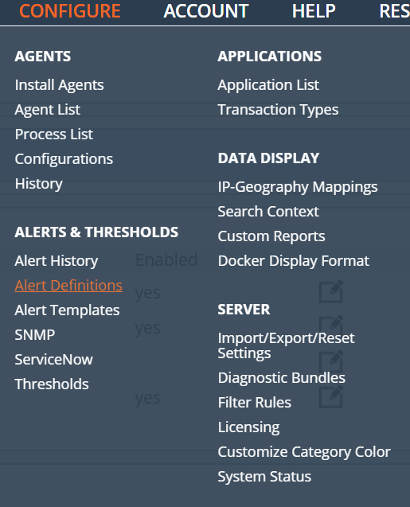
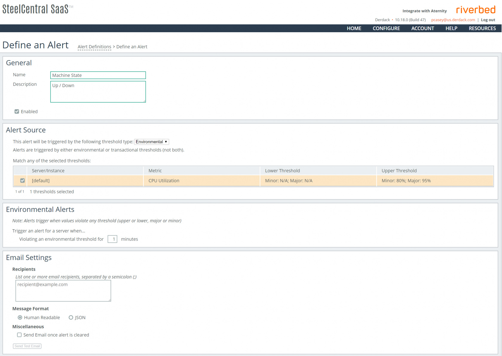

# SIGNL4 Integration with SteelCentral by Riverbed

Set notifications by going to Configure and Alert Definitions.

Click Add Definition and fill in the appropriate conditions.  Select the server an agent is installed and put in an email address to receive the notification.  This is where the SIGNL4 team email address goes.  Additional thresholds can be set in the Configure > Thresholds section.

The alert in SIGNL4 might look like this.

