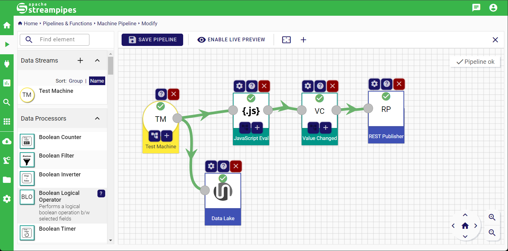
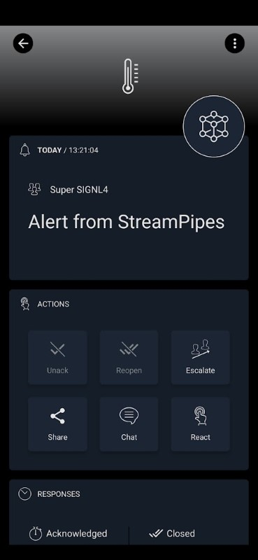

# SIGNL4 Integration with Apache StreamPipes

[Apache StreamPipes](https://streampipes.apache.org/) is a self-service Industrial IoT toolbox to enable non-technical users to connect, analyze and explore IoT data streams. It connects to PLC's, sensors or IoT devices and allows data processing, analysis, and displaying information on dashboards.

Apache StreamPipes supports many industrial protocols such as S7, MQTT, Modbus, OPC-UA and many other IT protocols such as Apache Kafka and Apache Pulsar.

SIGNL4 is a mobile alert notification app for powerful alerting, alert management and for mobile assignment of work items. Get the app at [https://www.signl4.com](https://www.signl4.com/).

StreamPipes offers an easy-to-use designer for your pipelines. The integration with SIGNL4 is straightforward.

## Prerequisites
- A [SIGNL4](https://www.signl4.com/) account
- Apache StreamPipes (download at [https://streampipes.apache.org/](https://streampipes.apache.org/))

## SIGNL4 Alerting Pipeline

You can use the REST Publisher data sink in StreamPipes to trigger (and close) alerts in SIGNL4. The following shows a sample pipeline.



You can download the sample pipeline from [here](signl4-alerting-pipelines.json).

The sample uses a test machine that generates sample data. The JavaScript Evel data stream processes the data and checks for the condition.

```javascript
function process(event) {

  // Trigger or close SIGNL4 alert
  
  event.Title = "Alert from StreamPipes";
  event["X-S4-ExternalId"] = "Machine-A2";
  
  if (event.mass_flow >= 8) {
  	event["X-S4-Status"] = "new";
  }
  else {
    event["X-S4-Status"] = "resolved";
  }
  

  return event;
}
```

The Value Changed data stream makes sure you we only send requests when the status (OK or Not OK) has changed.

That's it and you can adapt the flow to match your needs.

The alert in SIGNL4 might look like this.


