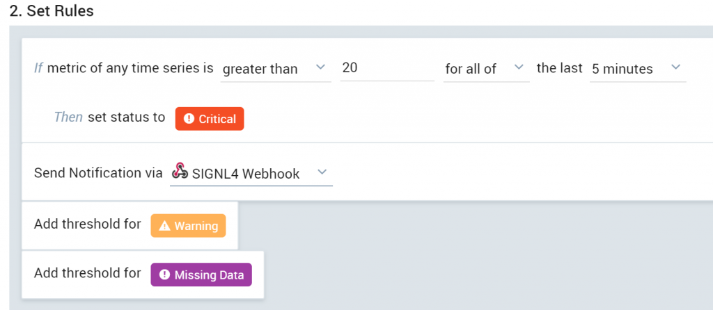
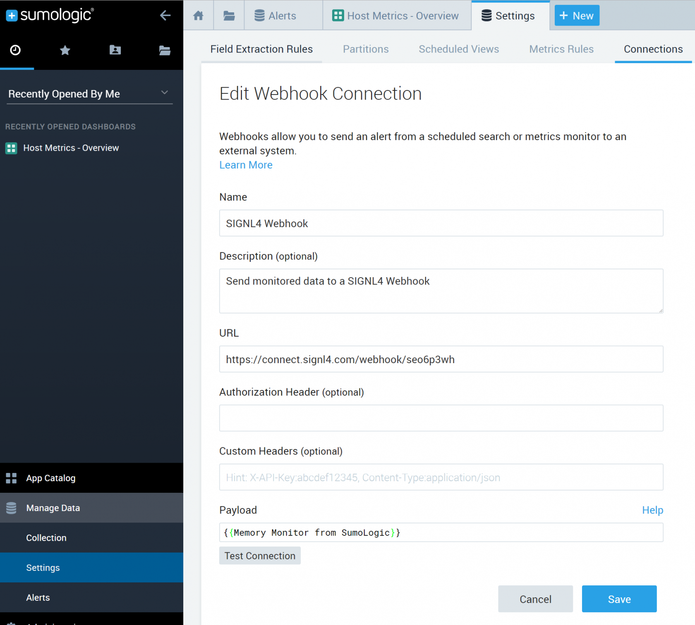

# SIGNL4 Integration with Sumo Logic

## How it works

Sumo Logic provides data and visual monitoring tools in real time to help you better manage your application. This is great, but there is no extension of this information stream beyond a desktop dashboard. SIGNL4 takes Sumo Logic beyond the dashboard with a simple integration so mobile team members can be reliably notified through persistent mobile push, text and voice calls with acknowledgement, tracking and escalation.

When creating and managing the Monitors, the second option (Set Rules) allows for you to enter an email address to notify when the alert is triggered.  Entering your SIGNL4 team email address here will pass all the data from the alert and notify your on-call duty members with all the information in the alert, separated out in an easy to read format.

## To set up a WebHook connection

Go to Manage Data -> Settings -> Connections.

On the "Connections" page click "Add".

Click "WebHook".

In the "Create Connection" dialog, enter the "Name" of the connection.

(Optional) Enter a "Description" for the connection.

Enter the "URL" for the endpoint.

(Optional) If the third-party system requires an "Authorization Header", enter it here

(Optional) "Custom Headers", enter up to five comma separated key-value pairs.

For "Payload", enter a JSON object in the format required by the target WebHook URL.

Click "Save".

Once you have that WebHook in place just adjust the alerts to trigger that webhook.

The alert in SIGNL4 might look like this.

