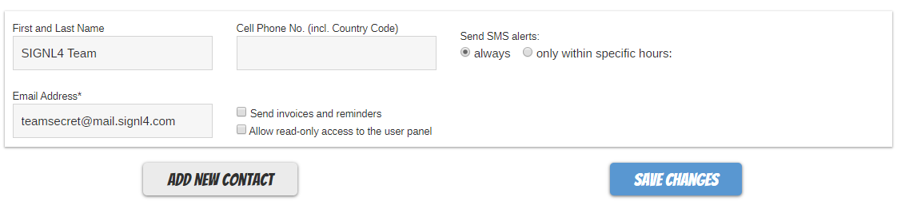
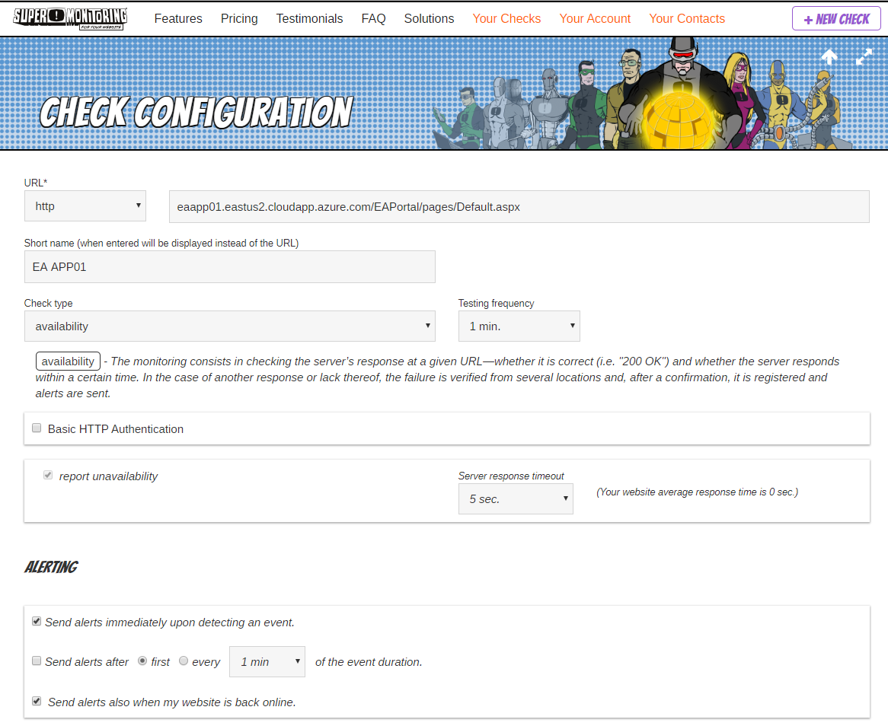
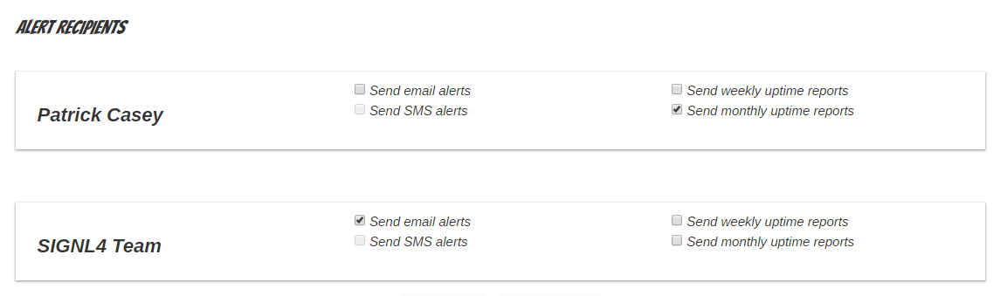
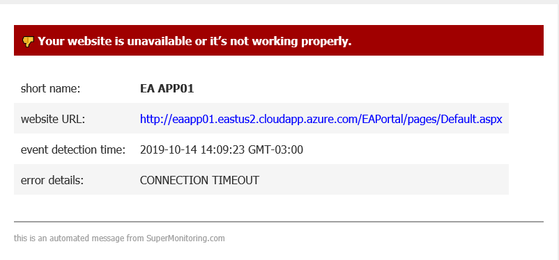
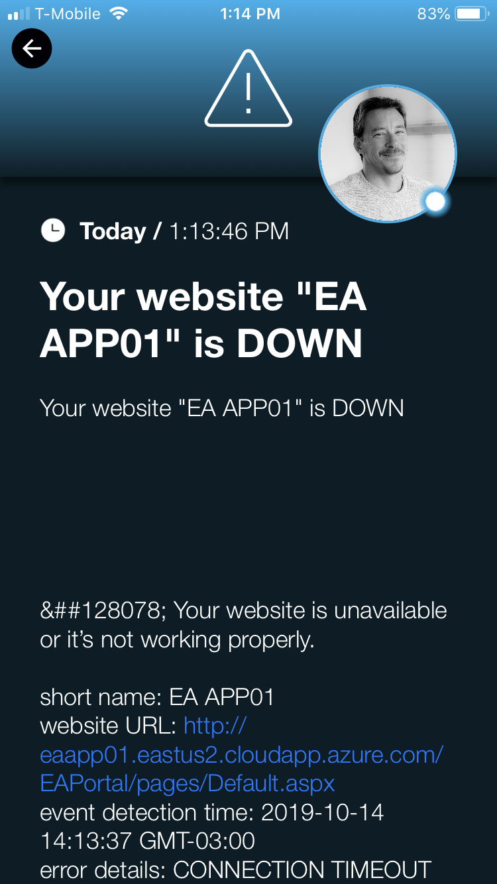
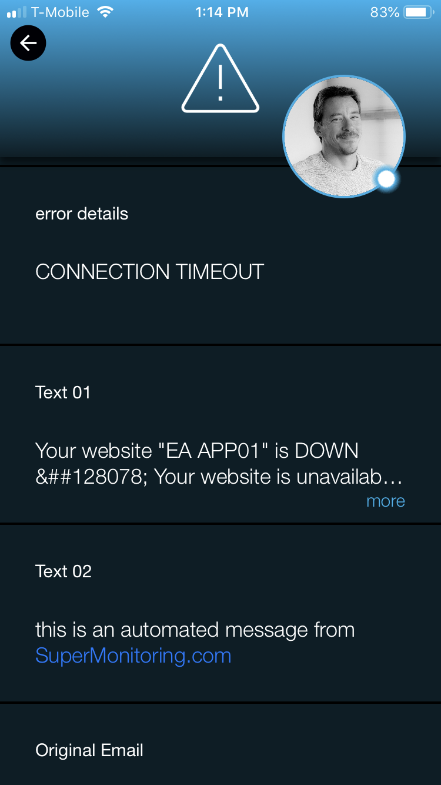

# SIGNL4 Integration with Super Monitoring

[Super Monitoring](https://www.supermonitoring.com/) is an agent less monitoring site that checks server and application availability. Super Monitoring will send out emails and SMS alerts but where SIGNL4 comes in is the ease of managing an on-call team with instant collaboration and ownership of those alerts.   Persistent notifications and tier escalation within SIGNL4 ensure that critical alarms are not missed.

In our example we are using Super Monitoring to monitor the up time of critical servers and applications.  We are forwarding SMTP notifications to the SIGNL4 team email address to receive the alerts.

SIGNL4 is a mobile alert notification app for powerful alerting, alert management and mobile assignment of work items.  Get the app at [https://www.signl4.com](https://www.signl4.com/)

## Prerequisites

- A SIGNL4 ([https://www.signl4.com](https://www.signl4.com/)) account
- A Super Monitoring ([https://www.supermonitoring.com](https://www.supermonitoring.com/)) account

## How to integrate

First create a contact with the SIGNL4 team email address.

Next, lets create a monitor. For this example, we will use an Azure VM that is turned off.

Click on Your Checks navigation item. Then Click New Check. Populate the URL and frequency of checks as well as alerting.

Under the recipients section, choose the SIGNL4 Team you created earlier and choose Send Email Alerts.

The dashboard will show when the website is unreachable. It then forwards an email to the SIGNL4 team in which the mobile app segregates data into an easily readable format.

Incoming alarms will look like this in SIGNL4.

