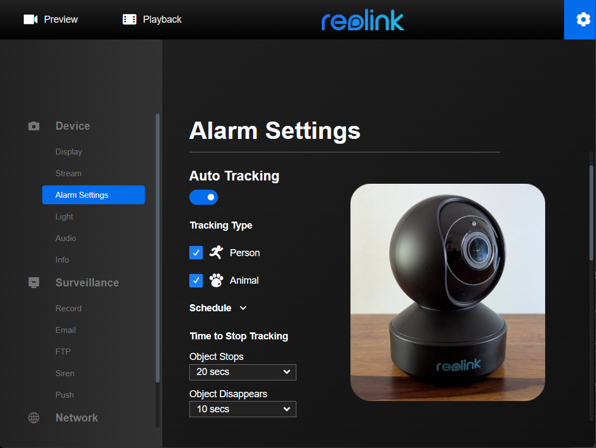
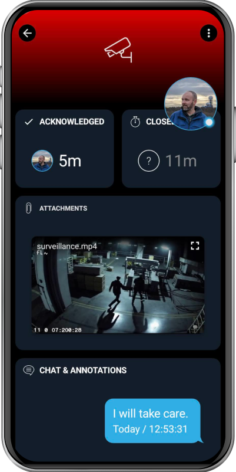

# SIGNL4 Integration with Surveillance Cameras

Surveillance and security cameras are commonly used to monitor facilities and detect unauthorized access. Modern systems increasingly leverage AI capabilities, such as distinguishing between humans and animals, to reduce false alarms and improve threat detection.

When a potential threat is identified, rapid notification of the responsible personnel is crucial to ensure timely intervention.

SIGNL4 augments surveillance and security systems with dependable mobile alerting. It provides a powerful set of features including a mobile app, push notifications, SMS, voice calls, automated escalations, and duty scheduling. This ensures that critical alerts are delivered instantly and reliably to the right people – anytime, anywhere.

## Prerequisites
A SIGNL4 (https://www.signl4.com) account
A surveillance or security camera capable of sending emails and / or HTTP requests 

## How to Integrate

In this example, we use a Reolink E1 Zoom camera, which can send email alerts when motion is detected. However, any IP camera that supports email or HTTP POST notifications will work with SIGNL4.

### Step 1: Configure Motion Detection

Begin by configuring your camera’s motion detection settings according to your specific needs – this can usually be done through the camera’s web interface.

### Step 2: Set Up Email Notifications

Navigate to the email alert settings in your camera’s web interface. There, enter your SIGNL4 team email address as the recipient. You can typically choose to attach an image snapshot or a short video clip of the detected event.

**TIP**: Most camera interfaces allow you to test the configuration live—take advantage of this to confirm successful delivery.

### Step 3: Save and Activate
Once the test is successful, save your settings. Your camera is now ready to trigger alerts.

# Receive Real-Time Alerts in SIGNL4
Whenever motion is detected, you will receive a real-time alert in your SIGNL4 app, including the attached snapshot or video. For example, this can help you respond quickly to unauthorized access.

To enhance the alert even further, you can use SIGNL4 categories to include a link to a live video stream, giving your team immediate situational awareness.

The alert in SIGNL4 might look like this.

