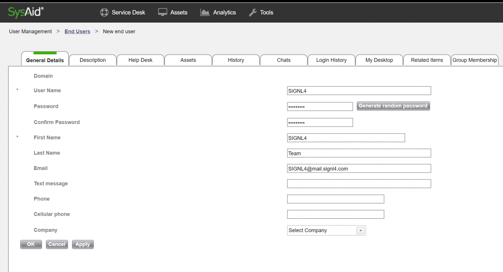
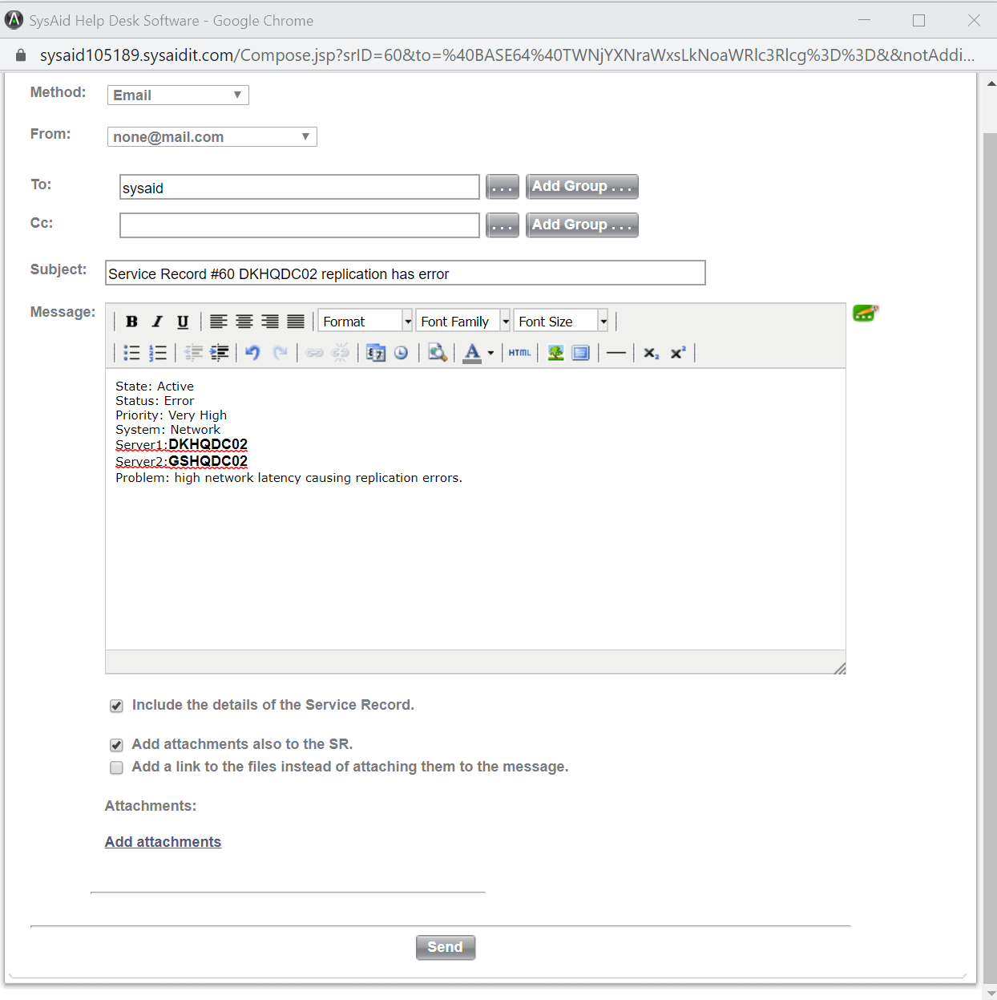

# SIGNL4 Integration with SysAid

[SysAid](https://www.sysaid.com/) can send out alerts, but all too often the emails that are sent from critical events are missed.

In our example we are sending incident data from SysAid to our SIGNL4 team by directing communication to a user with the unique team email address.

SIGNL4 is a mobile alert notification app for powerful alerting, alert management and mobile assignment of work items.  Get the app at [https://www.signl4.com](https://www.signl4.com/)

## Prerequisites

- A SIGNL4 ([https://www.signl4.com](https://www.signl4.com/)) account
- A SysAid ([https://www.sysaid.com/](https://www.sysaid.com/)) account

## How it works

First we need to create a user in SysAid with the SIGNL4 email address. This will allow us to dedicate assets, assign tickets and notify the SIGNL4 team of incidents that arise.  To create a user go to Tools > User Management and End Users.

From here you click on the Add icon and populate the user information with the SIGNL4 team details.

Once the user is created it can be assigned assets, assigned group membership and be specifically targeted for incidents that arise. We are going to use the latter here and target our SIGNL4 user for a New Incident.

Editing the Incident and assigning the user will provide ownership within SysAid. We are going to target the details here to the user via email.

The incident details shown above will pass along to the SIGNL4 team and on-duty team members will be alerted via Push, SMS and Voice.

The alert in SIGNL4 might look like this.

