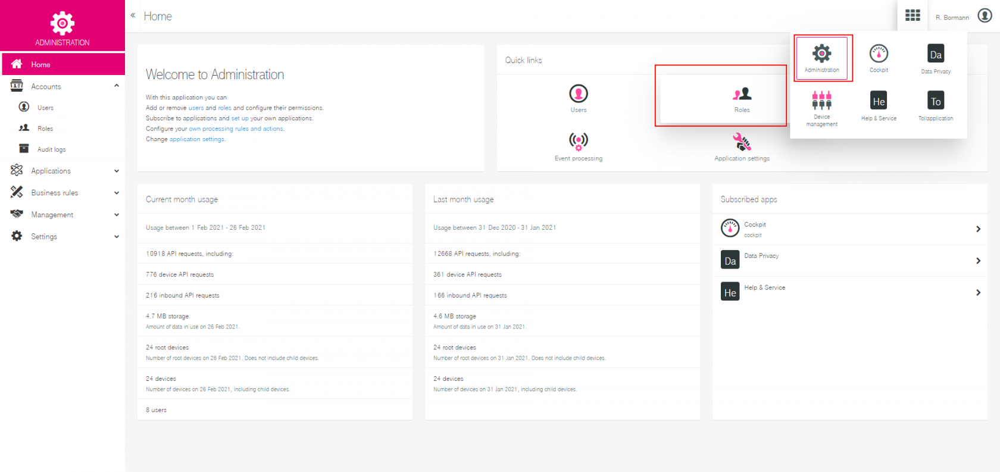
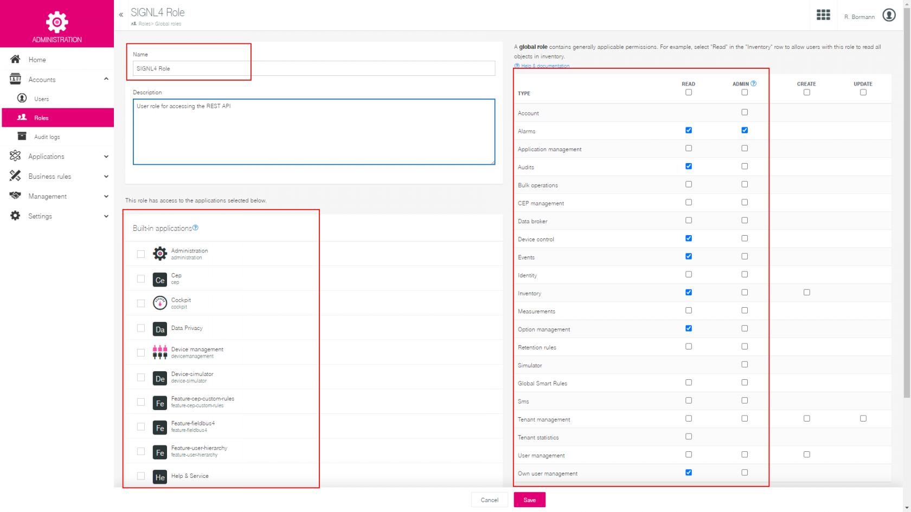
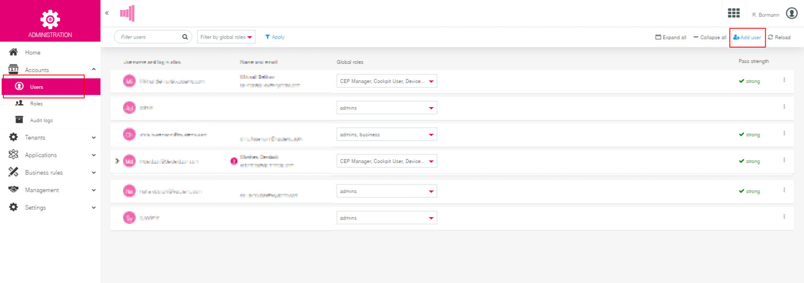
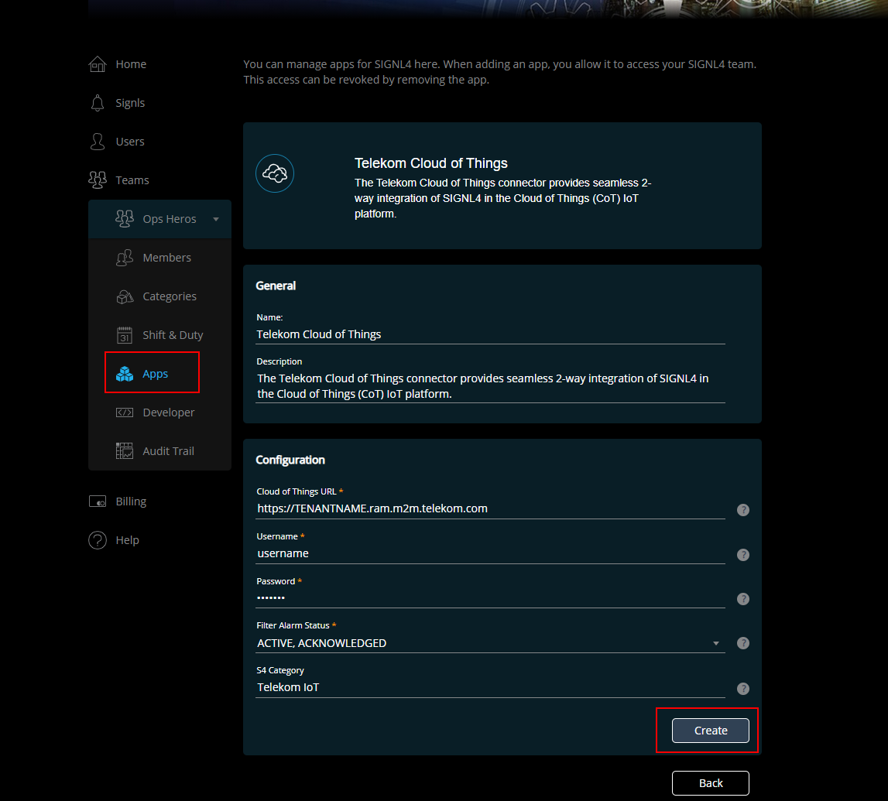
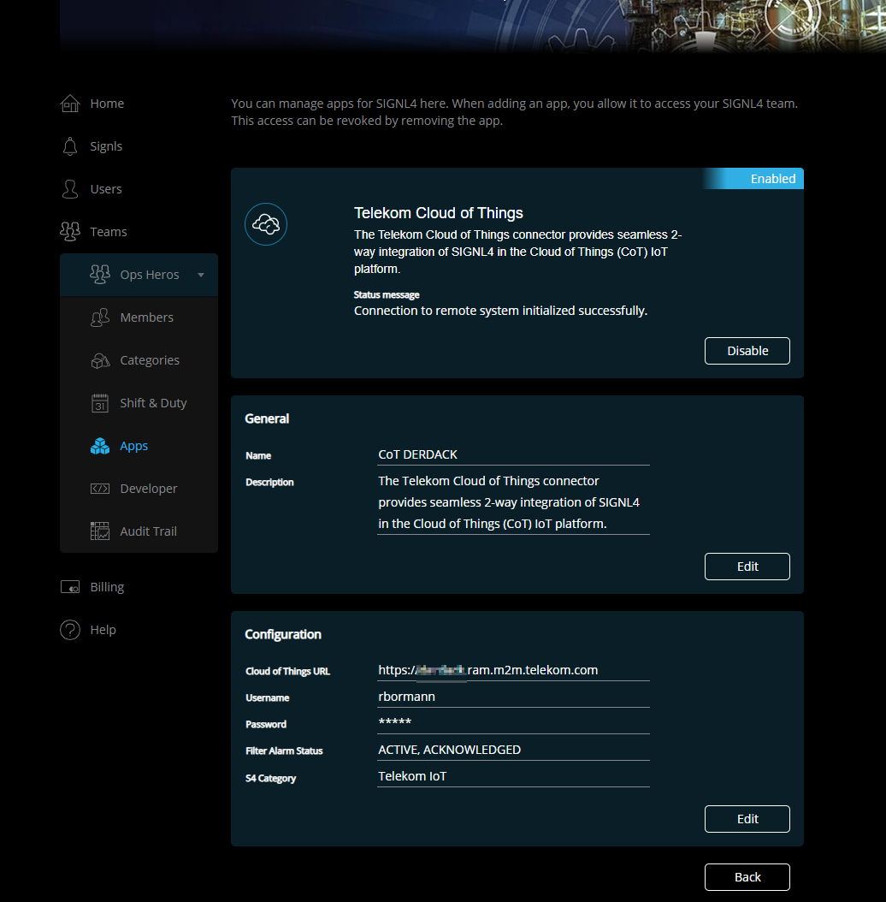

# SIGNL4 Integration with Telekom IoT Service Button

Telekom’s IoT Service Button sends information to the Telekom Cloud of Things when it is pressed. There, the status is displayed in the form of an alarm, but it is only when embedded in business processes that this device unfolds its full potential.

The integration is done via the REST API of the Cloud of Things, i.e. the corresponding connector app of SIGNL4 connects to this API and continuously retrieves new button press alarms from there.

In order for API access to work, it is mandatory that basic authentication is enabled for the API in the Cloud of Things. Furthermore, a user account for SIGNL4 must be created in the Cloud of Things (see below).

The integration is a two-way integration, i.e. button alarms are updated in the Cloud of Things when acknowledged or closed in SIGNL4. These actions also set the status from the button alarm in the Cloud of Things to CONFIRMED or RESOLVED. Conversely, the signl in SIGNL4 is also closed when the button alarm in the Cloud of Things cockpit is cancelled, e.g. by a central operator.

## Create SIGNL4 user role

SIGNL4 access to the Cloud of Things instance is done under a user context. This SIGNL4 user must be created in the Cloud of Things and given a special role that only grants the permissions in the Cloud of Things that SIGNL4 actually needs. So the first thing to do is to create the user role as described below:

1. Log in to your Cloud of Things instance as an administrator.
2. In the Quick Links section, click on “**Roles**” and on the page that appears, click on "Add role".
3. Enter the name "**SIGNL4** User Role" and an optional description.
4. Now set the following rights for this role:
    - **READ**: alarms, audits,device control,events,options,master data,own user
    - **ADMIN**: Alarms
5. Click on "Save".

Done! This role now gives SIGNL4 the ability to read alarms, get events via long-polling, query button card data, etc. However, since you have in no way assigned rights to predefined applications, this user will never be able to log into the Cloud of Things web portal, for example – an ideal integration user, in other words!

## Create user account for SIGNL4

The next step is to create a separate user account for SIGNL4 in the Cloud of Things. This is done as follows:

1. Log in to your Cloud of Things instance as administrator.
2. Click on Administration in the top right navigation and then select "Accounts" -> "Users" in the left menu
3. Click on "Add user"
4. Now enter the following data:
    - Username: "signl4"
    - E-mail: "signl4@mycompany.com". You can enter any email address that you have access to.
    - Now uncheck "Send password reset link as email" and enter a password.
    - Now give the user the role "SIGNL4 Role" in the right area, which you have created before.
5. Click on "Save".

Done! You will need this user account in the next step when you set up the connector app in SIGNL4.

## Create the connector app in SIGNL4

Next, add the Telekom Cloud of Things connector app to your SIGNL4 team. It will then continuously retrieve new button alerts from the Cloud of Things environment.

1. Log in to SIGNL4 as an Administrator.
2. Now click on "Apps**” for the team you want to set up the connection for.
3. At the bottom under App Templates you find Telekom Cloud of Things and click on "Create".
4. Now configure the connection parameters as described below:
    - **Cloud of Things URL**: Here you enter the URL to your Cloud of Things (https://TENANTNAME.ram.m2m.telekom.com).
    - **Username**: Here you enter the username from the account you previously created in the Cloud of Things for SIGNl4 (signl4).
    - **Password**: Here you enter the password of the account that you have previously created in the Cloud of Things for SIGNl4.
    - **Filter Alarm Status**: If an alarm in ‘Cloud of Things’ has a status that is not selected here, related button press events will be discarded and no signl will be triggered. In other words, if you want to get a new signl in SIGNL4 for every button press regardless of whether there is already an alarm for that button n the Cloud of Things, then select "ACTIVE" and "CONFIRMED" here.
    - **S4 Category**: Here you can specify the name of a SIGNL4 category to which new signls should be assigned. 5.
5. Now click on "Create". The connector is activated and immediately connects to the Cloud of Things.

The alert in SIGNL4 might look like this.

