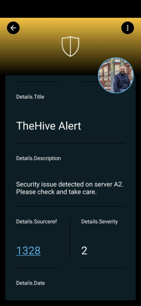

# SIGNL4 Integration with TheHive

[TheHive](https://thehive-project.org/) is a scalable, cloud-based or on-premise Security Incident Response Platform, tightly integrated with MISP (Malware Information Sharing Platform). It is designed to makes life easier for SOCs, CSIRTs, CERTs and any information security practitioner when dealing with security incidents that need to be investigated and acted upon swiftly.

SIGNL4 extends TheHive and adds app-based mobile alerting and incident response including push, SMS text, voice calls, escalations and collaboration. The integrated duty planning helps you to schedule your team’s on-call duties and allows you to see who is on duty at any given time.

In the TheHive web portal log in as a user to configure SIGNL4 alerting.

In the user portal under Organization -> Endpoints you can create a new Webhook endpoint and use the SIGNL4 webhook URL.

```
https://connect.signl4.com/webhook/{team-secret}
```

Here, {team-secret} is your SIGNL4 team secret.


Now, under Organization -> Notifications you can create a new Notification. Under Notifiers select your SIGNL4 webhook endpoint and as Trigger select what is suitable for your scenario, e.g. “AnyEvent” or “AlertCreated”.

That’s it. Now your SIGNL4 team gets notified when there is a new event or alert available in TheHive.


If you would like to have a deeper integration, e.g. two-way, certain formatting, etc. you might want to use a no-code platform like [n8n](https://n8n.io/) for integrating SIGNL4 with TheHive. You can find a [sample workflow](https://n8n.io/workflows/1630) here.


The alert in SIGNL4 might look like this.


