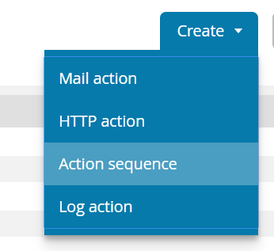
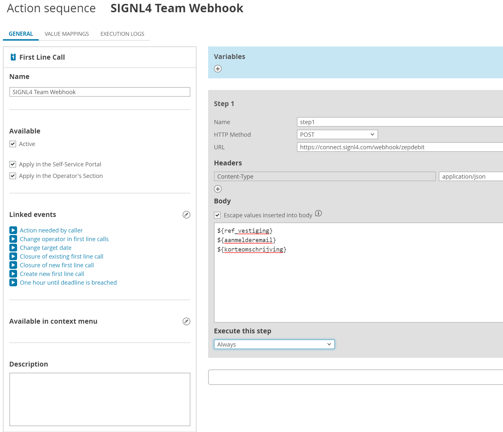
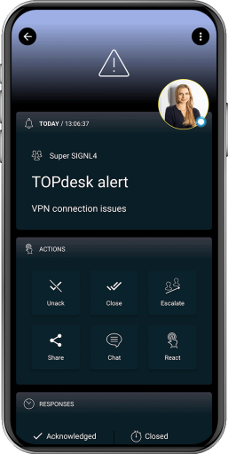

# SIGNL4 Integration with TOPdesk

## SIGNL4 Connector App

The TOPdesk connector app makes two-way integration with TOPdesk  a child’s play and responding to service desk tickets can be done conveniently via the SIGNL4 mobile app.

**Feature overview**:
- Retraiving tickets of your choice to SIGNL4
- Status synchronization between both systems
- Issue notes on status changes in SIGNL4

### How does it work?

The connector communicates with the TOPdesk API to read ticket details or to update them. According permissions must be enabled in TOPdesk.

In SIGNL4 you create a new connector integration “TOPdesk”. Here you configure the connector and enter your data. You will find a description as a tooltip directly on the configuration page. The following data is particularly important.

Instance URL: The URL of your TOPdesk instance, for example: https://your-instance.topdesk.net/

Username: The username for your TOPdesk account.

Password: The application password for the TOPdesk account.

After saving, current (last hour) tickets are retrieved from TOPdesk and an alert is sent to the appropriate SIGNL4 team.

<iframe width="560" height="315" src="https://www.youtube.com/embed/zaWgjGCcfI8?si=ftWQgbkaSPaNVMlZ" title="YouTube video player" frameborder="0" allow="accelerometer; autoplay; clipboard-write; encrypted-media; gyroscope; picture-in-picture; web-share" referrerpolicy="strict-origin-when-cross-origin" allowfullscreen></iframe>

## Alternative Method

A simple alternative (but one-way) method is to use a simple webhook integration as described below.

First lets setup the Webhook. From the left navigation select Action Explorer and choose First Line Call under **Call Management**.

Next, click on Create and select Action Sequence.

Ensure that First Line Call is selected from the list and click Create New Action Sequence.

Populate the following fields:
1. Name
2. Availability options
3. Linked Events
4. HTTP method is POST and URL is the SIGNL4 webhook
5. Make sure that all necessary parameters are put in the body
6. Execute this step should be set to always

Click save.

The next ticket that is created should now trigger an alert to your SIGNL4 team and appear accordingly in the mobile app.

The alert in SIGNL4 might look like this.

