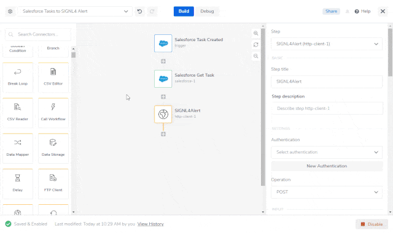

# SIGNL4 Integration with Tray.io

[Tray.io](https://www.tray.io/) is an integration platform that allows you to automate processes across any cloud stack. It helps to reduce your own integration efforts significantly. Pairing this powerful platform with SIGNL4 can enhance your daily operations with an extension to your team wherever it is.

In our example we will send information about a new Task in Salesforce to our SIGNL4 team.

SIGNL4 is a mobile alert notification app for powerful alerting, alert management and mobile assignment of work items. Get the app at [https://www.signl4.com](https://www.signl4.com/).

## Prerequisites

- A SIGNL4 ([https://www.signl4.com](https://www.signl4.com/)) account
- A Tray.io ([https://www.tray.io](https://www.tray.io/)) account

A Salesforce account ([https://www.salesforce.com](https://www.salesforce.com/)) for our example (optional)

## How it works

Log on to the Tray.io platform at [https://app.tray.io](https://app.tray.io/).

Now you can create a new workflow consisting of three steps:

1. Trigger: Salesforce Task Created  
2. Salesforce Get Task  
3. Http Client: Here we send the HTTP POST request to SIGNL4 in order to trigger the alert.

Our Trigger is a Salesforce Connector with the operation On Record Create or Update. This requires an authentication with your existing Salesforce account. The Trigger will start our flow each time a new Task has been created in Salesforce.

The second step in our flows is a Salesforce Connector with the operation Find records and with the Record type Task. We use this to find the previously creates task with the Activity ID $.steps.trigger.Id.

We send an HTTP Push request to SIGNL4 in order to trigger an alert. The URL is your SIGNL4 webhook URL including your team secret. The content-type is application/json and the Body is the JSON payload. In our case we assemble the body dynamically from the Salesforce Task data.

For testing you can create a new Task in Salesforce. This will trigger the workflow in Tray.io and as a result send the task data to your SIGNL4 team.

.png)

You can find a sample in GitHub:  
[https://github.com/signl4/signl4-integration-tray-io](https://github.com/signl4/signl4-integration-tray-io)

The alert in SIGNL4 might look like this.

