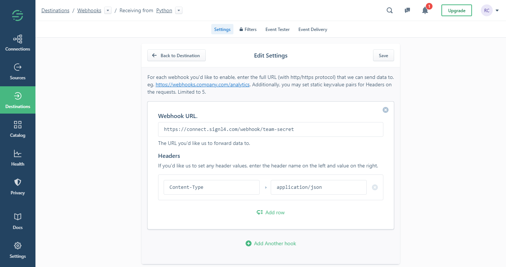
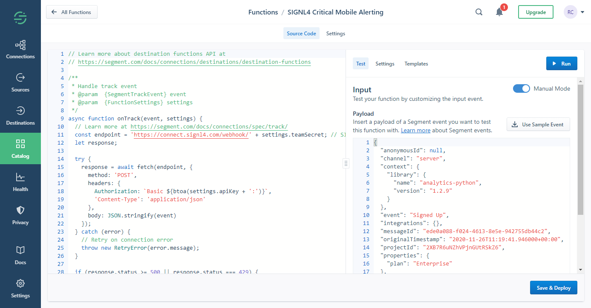

# SIGNL4 Integration with Twilio Segment

When critical events happen, SIGNL4 is the fastest way to alert your staff, engineers, or other teams on call and "in the field". SIGNL4 provides reliable notifications via mobile app push, text and voice calls with tracking, escalations and duty scheduling.

[Segment](https://segment.com/) is a leading customer data platform offering software and APIs to collect, clean, and control customer data. Segment collects user events from your web & mobile apps and provides a complete data toolkit to different teams (e.g. customer services, sales, marketing, product or engineering) in your company.

Pairing Segment with SIGNL4 can enhance your daily operations with an extension to your team wherever it is. The integration allows you to know when a critical issue has occurred.

The integration of Twilio Segment and SIGNL4 is done either using a Webhook destination or using a dedicated destination function. In our example we send an customer information from a Python script and then send an alert to our SIGNL4 team.

## Prerequisites

- A SIGNL4 account ([https://www.signl4.com](https://www.signl4.com/))
- A Segment account ([https://segment.com](https://segment.com/))

## How to integrate

You can choose the Webhook as destination and within your webhook settings you specify your SIGNL4 webhook URL including your team secret.

Alternatively you can use a destination function that gives you even more flexibility. When adding a function you can see sample code that already sends an HTTP request. Here you just need to adapt the endpoint and assign your SIGNL4 webhook URL including the team secret. You can add additional parameters as needed.

That is it and now you can test the alert. To do this you can simply use the test functionality within your webhook or function destination. You should then receive an alert in your SIGNL4 app.

The alert in SIGNL4 might look like this.

