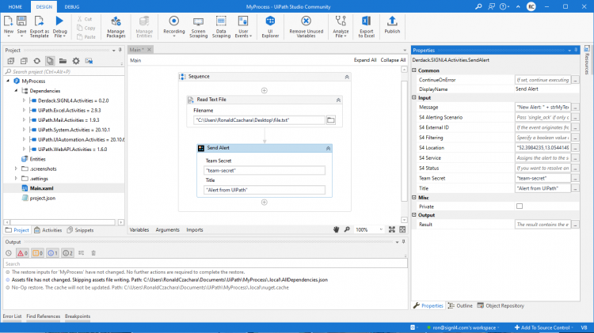

# SIGNL4 Integration with UiPath

When critical systems fail, SIGNL4 is the fastest way to alert your staff, engineers, IT admins on call and “in the field”. SIGNL4 provides reliable notifications via mobile app push, text and voice calls with tracking, escalations and duty scheduling.

[UiPath](https://www.uipath.com/) is an RPS (Robotic Process Automation) system for automating repetitive tasks to increase efficiency and to free your teams to spend time on work with better returns.

Pairing UiPath with SIGNL4 can enhance your daily operations with an extension to your team wherever it is. The integration does not only allow you to know when a critical issue has occurred but also when it was resolved no matter where you are.

The integration of UiPath and SIGNL4 is done using a ready-to-use Custom Activity. This one generates an alert and sends it to a SIGNL4 team.

## Prerequisites
- A SIGNL4 account ([https://www.signl4.com](https://www.signl4.com))
- A UiPath account ([https://www.uipath.com](https://www.uipath.com)) and UiPath Studio installed

## Integration Steps

Below we describe the steps necessary to integrate the SIGNL4 with UiPath.

### Create the Sequence

Open your Sequence in UiPath Studio or create a new one.

### SIGNL4 Alerting

You can now send a SIGNL4 alert at a suitable point in your sequence. To do this, add an Action and then search for SIGNL4. If you cannot find it you can also download the Custom Activity [here](https://marketplace.uipath.com/listings/signl4-critical-mobile-alerting). Add the Action “Send Alert”. Here you can enter the appropriate alert parameters, for example Title or Message. Also enter your SIGNL4 team secret here, i.e. the first part of your SIGNL4 email address.

## Test it

That is it and now you can test the alert. You can do so directly in UiPath Studio by running or debugging your file and you should then receive an alert in your SIGNL4 app.

The alert in SIGNL4 might look like this.

