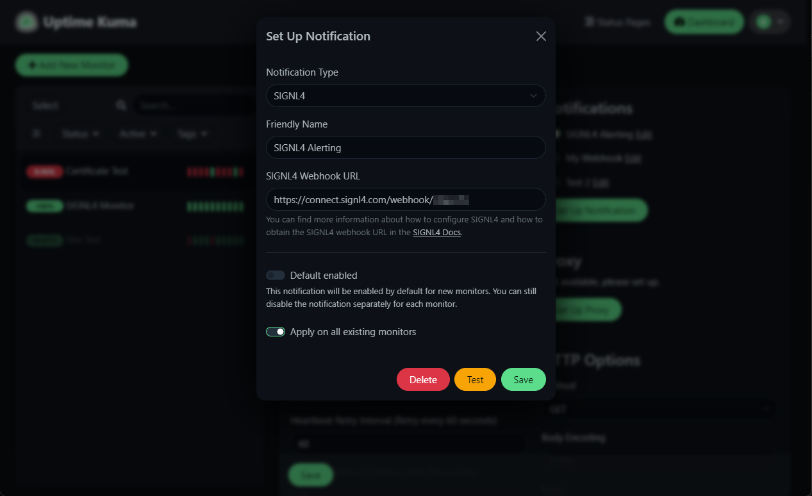
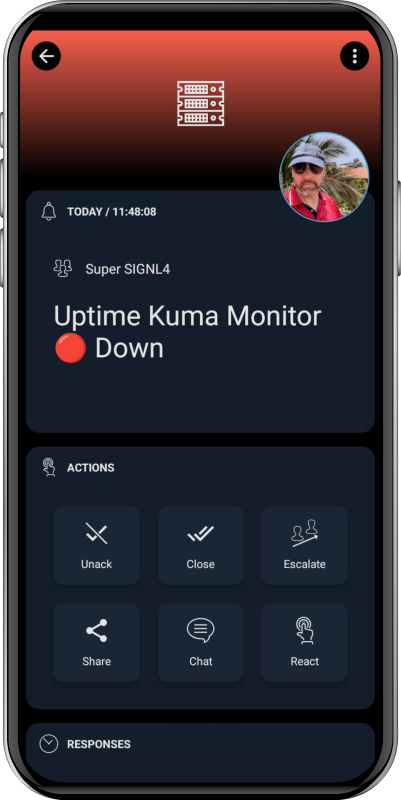

# SIGNL4 Integration with Uptime Kuma

[Uptime Kuma](https://uptime.kuma.pet/) is an easy-to-use self-hosted monitoring tool that. It offers a variety of monitoring types, including web-site and certificate checks, as well as status pages.

When critical systems fail, SIGNL4 is the fastest way to alert your staff, engineers, IT admins on call and “in the field”. SIGNL4 provides reliable notifications via mobile app push, text and voice calls with tracking, escalations and duty scheduling. Int integrates natively with Uptime Kuma.

## Prerequisites

- A SIGNL4 ([https://www.signl4.com](https://www.signl4.com/)) account
- An Uptime Kuma instance ([https://uptime.kuma.pet/]](https://uptime.kuma.pet/))

## How to Integrate

SIGNL4 is available as a notification provider in Uptime Kuma. You can set it up by going to an available monitor. Here you click Set Up Notification and choose SIGNL4 as notification type. Here you just need to enter your SIGNL4 webhook URL. That's it and now you can test the SIGNL4 notification.

The alert in SIGNL4 might look like this.

