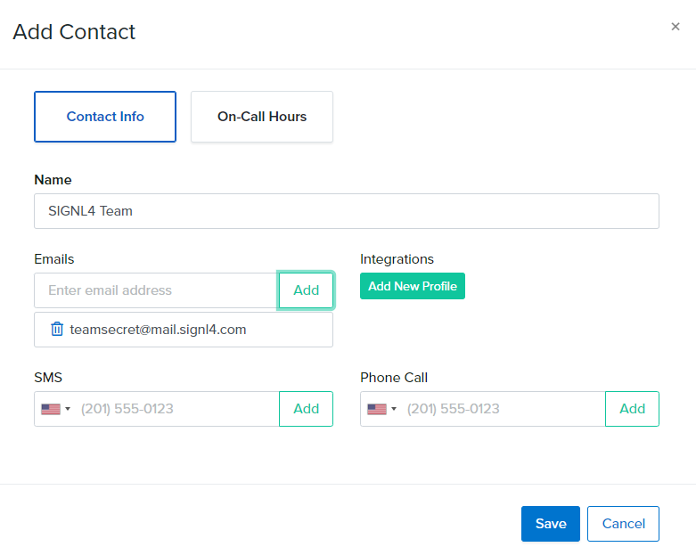
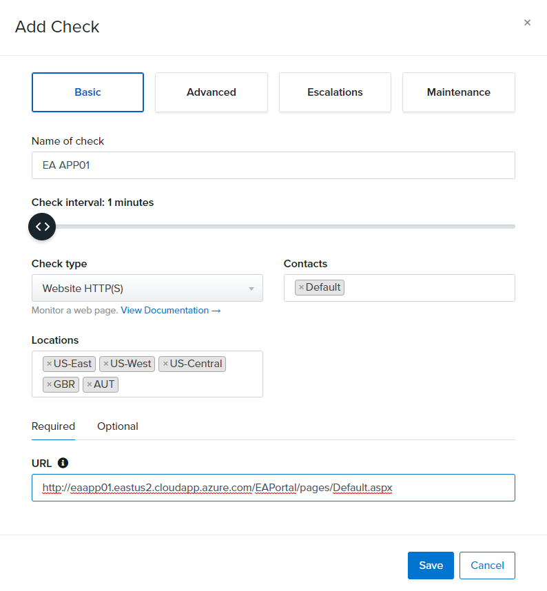
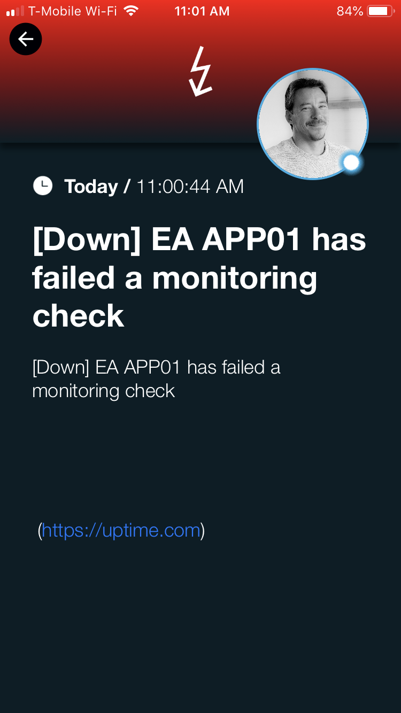

# SIGNL4 Integration with Uptime

Get website downtime alerts by SMS, phone call or email if your website is down. [Uptime.com](http://uptime.com/) checks your website availability at one-minute intervals from 30 different locations across 6 continents.  Uptime can send out email and SMS alerts but where SIGNL4 comes in is the ease of managing an on-call team with instant collaboration and ownership of those alerts.

In our example we are using Uptime to monitor the up-time of critical servers.  We are forwarding SMTP notifications to the SIGNL4 team email address to receive the alerts.

SIGNL4 is a mobile alert notification app for powerful alerting, alert management and mobile assignment of work items.  Get the app at [https://www.signl4.com](https://www.signl4.com)

## Prerequisites
- A SIGNL4 ([https://www.signl4.com](https://www.signl4.com)) account
- An Uptime ([https://uptime.com](https://uptime.com)) account

## How to integrate

First create a contact with the SIGNL4 team email address.

Next, lets create a monitor. For this example, we will use an Azure VM that is turned off.

Populate the Check interval time and URL under the Basic Tab.

Next populate the SIGNL4 team in the escalation tab.

The dashboard will show when the website is unreachable. It then forwards an email to the SIGNL4 team in which the mobile app segregates data into an easily readable format.

