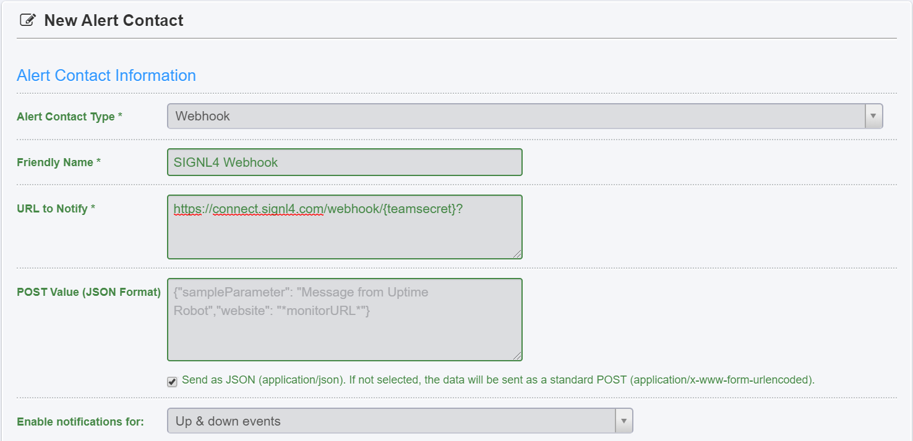
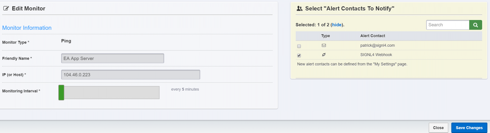
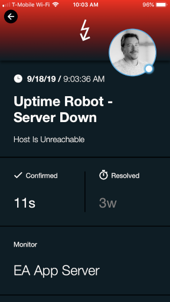

# SIGNL4 Integration with UptimeRobot

In our example we are using UptimeRobot to monitor the up-time of critical servers.  We are setting up a SIGNL4 Webhook as the method of receiving the alerts.SIGNL4 is a mobile alert notification app for powerful alerting, alert management and mobile assignment of work items.  Get the app at [https://www.signl4.com](https://www.signl4.com).

## Prerequisites
- A SIGNL4 ([https://www.signl4.com](https://www.signl4.com)) account
- A UptimeRobot ([https://uptimerobot.com](https://uptimerobot.com)) account

First, let’s create a method for SIGNL4 to receive alert information. In the My Settings link click on Add Alert Contact.

Populate the new Webhook Information with a Friendly Name, the SIGNL4 webhook URL and be sure to check the Send as JSON box.

In the POST value put in JSON format such as "Parameter": "Value". Here is an example:

```json
{
    "Monitor": "*monitorFriendlyName*",
    "Type": "*alertType*",
    "Message": "*alertDetails*",
    "URL": "*monitorURL*",
    "X-S4-Service": "UptimeRobot"
}
```


Click Create Alert Contact button.

Next we will create a new Monitor. From the Home screen click on Add New Monitor.

For this example, we will choose Ping and put in the IP address of the server. Be sure to search and select the SIGNL4 Webhook created in step 2 and click Create Monitor.



That’s it! The next time this alert is triggered, data will be sent from UptimeRobot to your SIGNL4 team.

Augment the SIGNL4 alerts for easy viewing within the mobile app. Under Services and Systems you can create a category and select the color, icon and adjust the title and text that is received.


