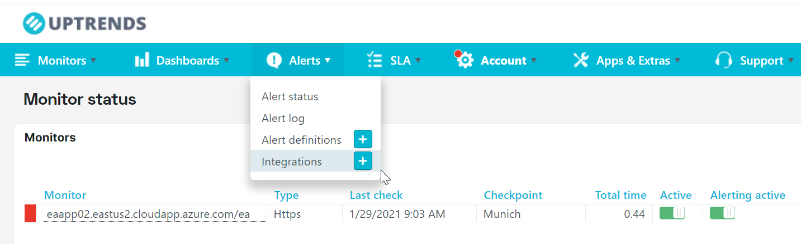
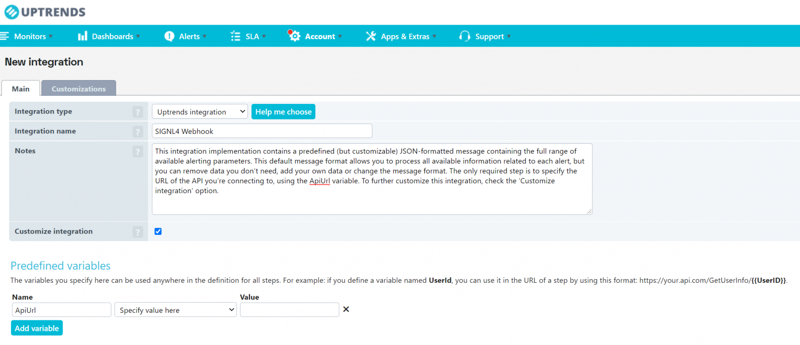
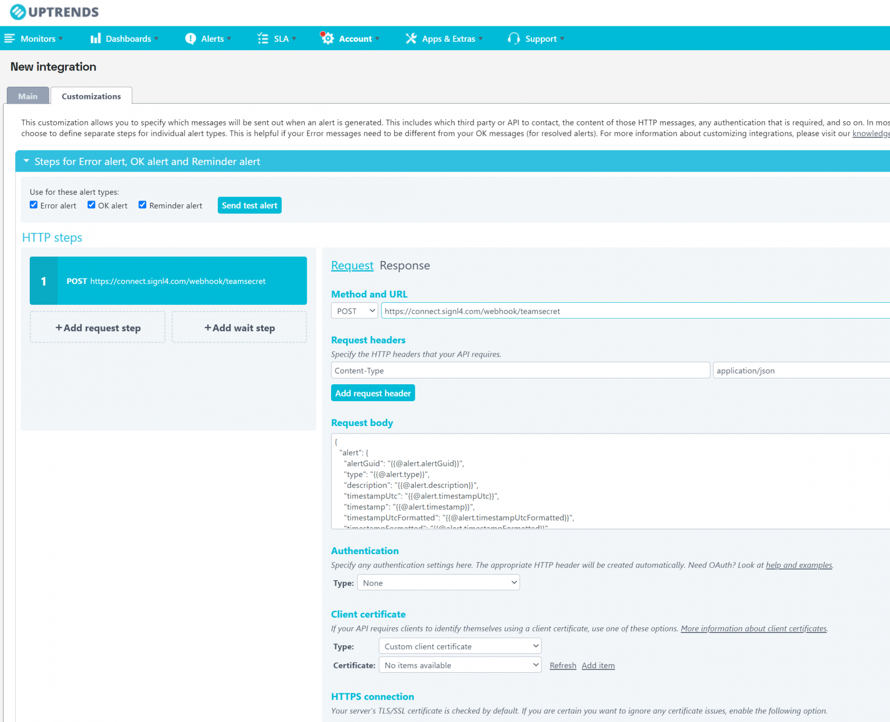
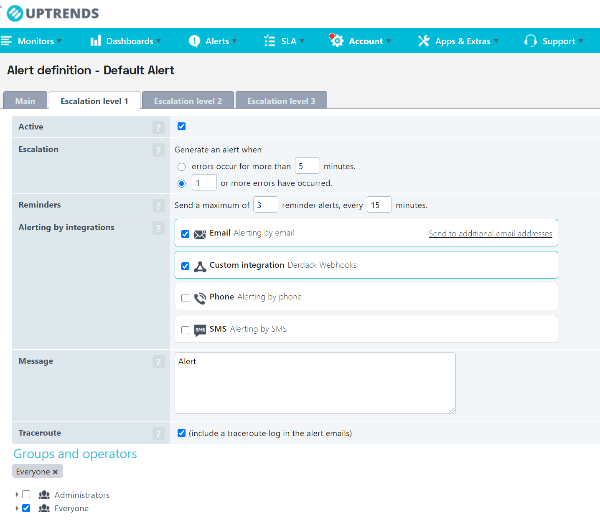
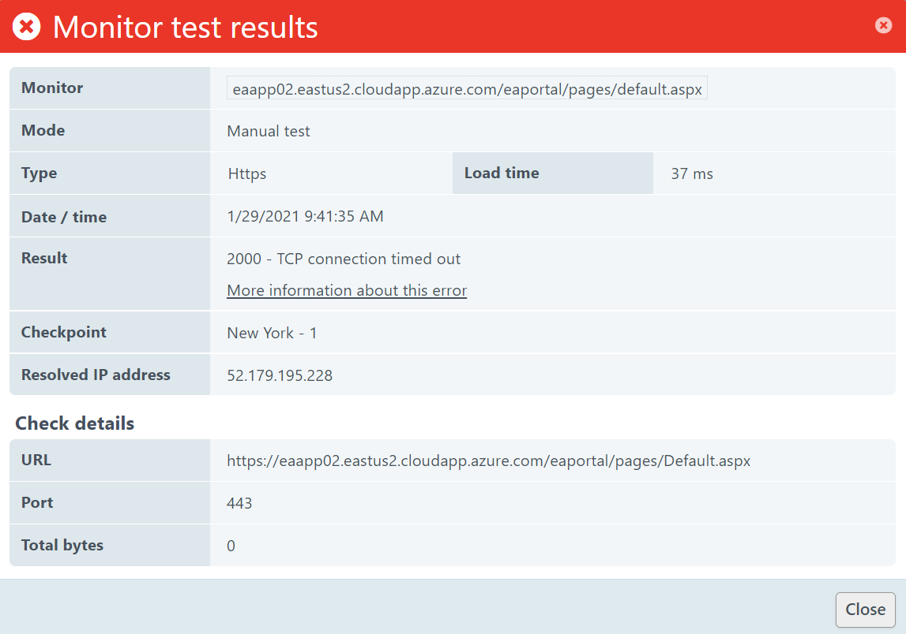

# SIGNL4 Integration with Uptrends

Don’t just a get a text message or email when your website is down. [Uptrends](https://www.uptrends.com/) checks your website availability at one-minute intervals from 225 different locations worldwide. Uptrends can send out email and SMS alerts but where SIGNL4 comes in is the ease of managing an on-call team with instant collaboration and ownership of those alerts.   With persistent notifications and escalation chains there will never be a critical alert that goes unattended. SIGNL4 also offers ad-hoc collaboration between team members for each and every alert, so Subject Matter Experts can be looped in to help resolve issues.

In our example we are using Uptrends to monitor the up-time of critical servers.  We are forwarding website down alerts via webhook to our SIGNL4 team.

SIGNL4 is a mobile alert notification app for powerful alerting, alert management and mobile assignment of work items. Get the app at [https://www.signl4.com](https://www.signl4.com)

## Prerequisites
- A SIGNL4 ([https://www.signl4.com](https://www.signl4.com)) account
- An Uptrends ([https://uptrends.com](https://uptrends.com)) account

## How it works

Let’s customize a webhook integration within Uptrends to make sure that we are sending an alerts that are raised to our SIGNL4 team. From the Main Menu, select Alerts and then choose Integrations.

On Integrations page, you will enter the Type of Uptrends Integration and give it a name.

On the customizations tab leave the Method as POST and enter the webhook URL for your SIGNL4 team. The rest of the defaults can be left as is.

Saving this integration will now allow you to add this Integration to an Alert Definition. To do this select Alerts > Alerting Definitions > Default Alert.  Make sure to check the box for the Custom Integration created earlier.

Now, the next time the websites that are monitored are unavailable, SIGNL4 will receive the alert data via webhook and notify your on-call team.

Emails can also be forwarded to your SIGL4 team.

Emails received will display in the mobile app like this.

