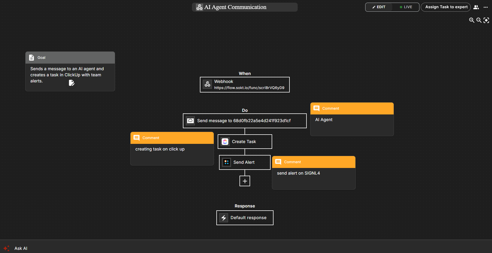

# SIGNL4 Integration with viaSocket

[viaSocket](https://viasocket.com/) helps to link up your apps, share or store data smoothly in table or create engaging interfaces, all without a single line of code. Pairing Make with SIGNL4 can enhance and automate your daily tasks with an extension to your mobile team no matter where they are.

SIGNL4 is directly available as an app in viaSocket. You can just add the SIGNL4 app to your flow wherever you need reliable mobile alerting.

SIGNL4 is a mobile alert notification app for powerful alerting, alert management and mobile assignment of work items. Get the app at [https://www.signl4.com](https://www.signl4.com/).

## Prerequisites

- A [SIGNL4](https://www.signl4.com/) account
- A [viaSocket](https://viasocket.com/) account

## How to Integrate

In viaSocket you create a new flow, e.g. triggered by a webhook. In your flow you add SIGNL4. There are two actions available:
**Send Alert**: Triggers an alert in SIGNL4.  
**Resolve Alert**: Closes a previously triggered alert in SIGNL4. You need to make sure to use the same External ID.

You can test the activities directly within the configuration page.

## Test it

That is it. Now you can save the flow and test it. You should then receive an alert on your SIGNL4 app.

The alert in SIGNL4 might look like this.

