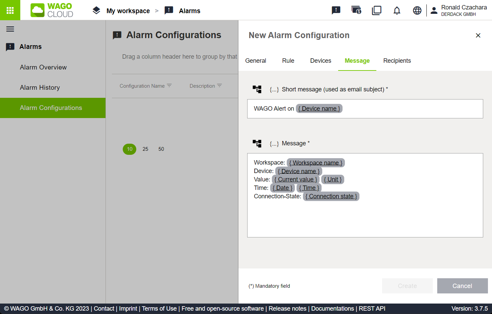

# SIGNL4 Integration with WAGO Cloud

[WAGO Cloud](https://www.wago.com/) lets you collect, analyze and monitor data of various machines and WAGO controllers from a central location.

## Prerequisites

- A [SIGNL4](https://www.signl4.com/) account
- A [WAGO Cloud](https://cloud.wago.com/) account

## How to integrate?

The integration of SIGNL4 with WAGO Cloud enables production staff and service technicians to be alerted quickly and reliably when problems are detected or even before problems arise, no matter where they are.

Triggering SIGNL4 alerts from WAGO Cloud is straightforward. In the WAGO Cloud portal Alarms -> Alarm Configurations. Here, you create a new alarm configuration. Specify the information under General, Rule and Devices according to your needs.

Under Message you enter the alert text, e.g. parameter / value pairs. You can also use placeholders. Here is an example.

```
Workspace: { Workspace name }
Device: { Device name }
Value: { Current value } { Unit }
Time: { Date } { Time }
Connection-State: { Connection state }
```



Under Recipient you add the SIGNL4 team email address you for triggering the alert, e.g. {team-secret}@mail.signl4.com, where {team-secret} is your SIGNL4 team or integration secret.

The alert in SIGNL4 might look like this.


