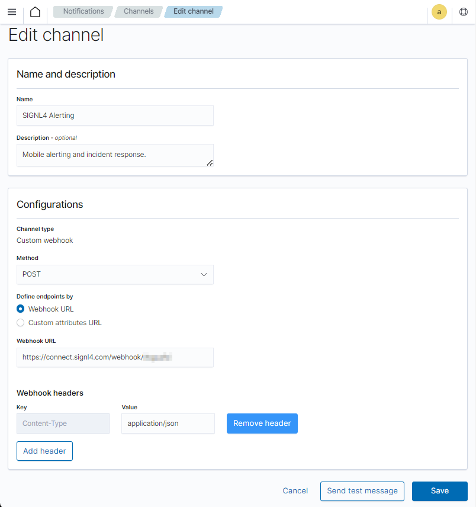
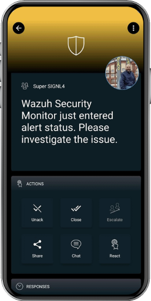

# SIGNL4 Integration with Wazuh

## SIGNL4 Integration with Wazuh

You can configure the Wazuh integration with SIGNL4 as follows.

In the Wazuh web portal log in as a admin to configure SIGNL4 alerting.

Under Notifications create a new channel of the type Custom webhook. The Webhook URL is your SIGNL4 webhook URL including team or integration secret.

```
https://connect.signl4.com/webhook/{team-secret}
```

Here, {team-secret} is your SIGNL4 team secret.

The header value Content-Type is application/json.

You can also send a test alert here.



Under Alerting -> Monitors create a new monitor that triggers when you would like to send an alert. You need to configure the Trigger accordingly.


The Action will trigger the SIGNL4 alert. You select the SIGNL4 notification channel that you have created in the previous step. The message is in JSON format and might look like follows.

```json
{
"AlertMonitor": "{{ctx.monitor.name}} just entered alert status. Please investigate the issue.",
"Trigger": "{{ctx.trigger.name}}",
"Severity": "{{ctx.trigger.severity}}",
"PeriodStart": "{{ctx.periodStart}}",
"PeriodEnd": "{{ctx.periodEnd}}",
"X-S4-SourceSystem": "Wazuh",
"X-S4-ExternalID": "Wazuh: {{ctx.trigger.name}}",
"X-S4-Status": "new"
}
```

You can also automatically close alerts is the status in Wazuh is OK again. In this case you specify a Trigger for the OK condition and the message in the SIGNL4 action might look like this.

```json
{
"X-S4-ExternalID": "Wazuh: {{ctx.trigger.name}}",
"X-S4-Status": "resolved"
}
```

The value for X-S4-ExternalID is the same as for the previously opened alert.

This is it and an incoming alert will look like this.



