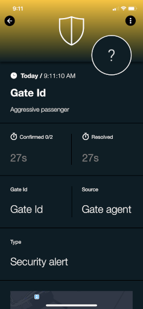
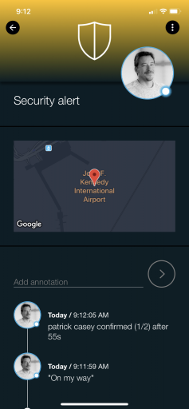

# SIGNL4 Integration with Webhook

Notifications of malfunctions, downtimes or other critical events can be triggered automatically or manually in SIGNL4.

The automatic triggering takes place through the connection to third-party systems, via which triggering events can then be received.

SIGNL4 offers various connector apps, APIs and interfaces for these connections. A very generic and therefore most used interface is the SIGNL4 webhook for incoming events. The webhook is essentially based on a unique URL that is entered in the third-party system and is called by it via HTTP(s) when a new event is present that is to be transmitted to SIGNL4.

The SIGNL4 webhook allows you to send events to your SIGNL4 team from external systems or applications. The base URL of the webhook is https://connect.signl4.com/webhook/. Other than the SIGNL4 API, authentication is based on an API key which is encoded in the request URI and matches your SIGNL4 team secret such as https://connect.signl4.com/webhook/{teamSecret}.

You can find more infiormation about the SIGNL4 webhook API [here](https://connect.signl4.com/webhook/docs/index.html).

### Trigger Alerts

The payload that we will pass through will be:

```json
{
    "Gate Id": "Gate Id",
    "Message": "Aggressive passenger",
    "Source": "Gate agent",
    "Type": "Security alert",
    "X-S4-Service": "Security",
    "X-S4-Location": "40.6413111,-73.7781391",
    "X-S4-AlertingScenario": "multi_ack",
    "X-S4-ExternalID": "INC091210"
}
```

The following parameters will enrich your Signl or to influence its processing as follows:

**X-S4-Service**: Assigns the Signl to the service/system category with the specified name.  
  
**X-S4-Location**: Transmit location information ('latitude, longitude') with your event and display a map in the mobile app.  
  
**X-S4-AlertingScenario**: If this event triggers a Signl, allows to control how SIGNL4 notifies the team.
- **single_ack**  
    Only one person needs to acknowledge this Signl.  
- **multi_ack**  
    The Signl must be confirmed by the number of people who are on duty at the time this Signl is created.  
- **emergency**  
    All people in the team are notified regardless of their duty status and must acknowledge the Signl, which is also assigned to the built-in emergency category.  
  
**X-S4-ExternalID**: If the event originates from a record in a 3rd party system, use this parameter to pass the unique ID of that record. That ID will be communicated in outbound webhook notifications from SIGNL4, which is great for correlation/synchronization of that record with the Signl.  
  
**X-S4-Filtering**: Specify a boolean value of true or false to apply event filtering for this event, or not. If set to true, the event will only trigger a notification to the team, if it contains at least one keyword from one of your services and system categories (i.e. it is whitelisted).  
  
**X-S4-Status**: If you want to resolve an existing Signl by an external id (X-S4-ExternalID), you can add this status parameter. It has three possible values:
- **new**  
    Default value which means that this event triggers a new Signl.  
- **acknowledged**  
    If you want to acknowledge a previously triggered Signl (e.g. someone responded in the 3rd party system and not in the mobile app during business hours), set the X-S4-Status to 'acknowledged' and provide an external ID via the 'X-S4-ExternalID' parameter for the Signl you want to acknowledge. It is only possible to acknowledge a Signl with a provided external id that initially triggered it.  
- **resolved**  
    If you want to resolve a previously triggered Signl (e.g. monitoring system has auto-closed the event), make sure to set the X-S4-Status to 'resolved' and provide an external ID via the 'X-S4-ExternalID' parameter for the Signl(s) you want to resolve. It is only possible to resolve a Signl with a provided external id that initially triggered it.  

You can also add query parameters which are each documented below. They are used to correlate the status of events in your 3rd party system with the Signl status in SIGNL4. You are thereby able to define when an event, sent to the webhook, should acknowledge or resolve a Signl that it has triggered earlier. An example is: https://connect.signl4.com/webhook/teamssecret?ExtIdParam=Id&ExtStatusParam=Status&ResolvedStatus=UP&AckStatus=PENDING

You can use your own JSON parameters as appropriate, e.g. HostName, SensorId, etc. SIGNL4 will try to display them in a nice format. 

You can try these steps out at the following URL:
[https://connect.signl4.com/webhook/docs/index.html](https://connect.signl4.com/webhook/docs/index.html)

- Open the description by clicking the "POST" button.
- Enter in Your Team Secret.
- Enter in the event data.
- Click "Try it Out".




## Close Alerts

In June 2020 we introduce the ability to use the webhook to update the status of an alert from the originating 3rd party system. Read more here: [https://www.signl4.com/blog/update-july-2020-resolve-alerts/](https://www.signl4.com/blog/update-july-2020-resolve-alerts/)

## Authentication and Security

The webhook uses a unique key, the so-called secret, for authentication. This secret is also a fixed part of its URL.  
Since the webhook is only accessible via TLS, the secret itself can never be read in plain text during data transmission (it is located in layer 7 of the OSI model, TLS encryption already takes effect from layer 4 of the OSI model).  
It is not possible to delete data via the SIGNL4 webhook. It is only used for event creation and can modify existing alarms. The URL should nevertheless be treated as highly confidential and only made accessible to authorized persons.

## Samples

### Simple curl Call

```bash
curl -d '{"Alert": "Hi.", "X-S4-ExternalId": "-1234", "X-S4-Status": "new"}' -H 'Content-Type: application/json'
https://connect.signl4.com/webhook/{team-secret}
```

### Trigger Alert

Trigger an alert.

```json
POST https://devconnect.signl4.com/webhook/{team-secret}
Content-Type: application/json

{
    "Title": "Test",
    "Message": "Alert",
    "X-S4-ExternalID": "sensor-id-1",
    "X-S4-Status": "new"
}
```

### Close Alert

Resolve (close ) the previously triggered alert.

```json
POST https://devconnect.signl4.com/webhook/{team-secret}
Content-Type: application/json

{
    "X-S4-ExternalID": "sensor-id-1",
    "X-S4-Status": "resolved"
}
```

### Code Snippets

You can find some sample code snippets [here](https://github.com/signl4/code-snippets).
