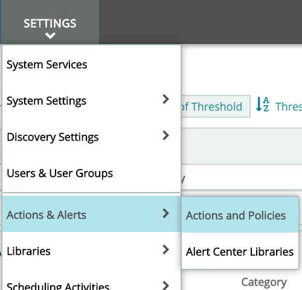
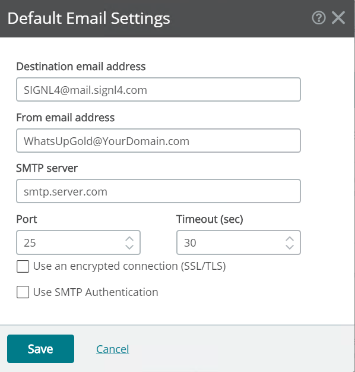
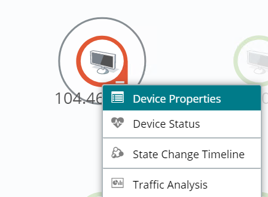
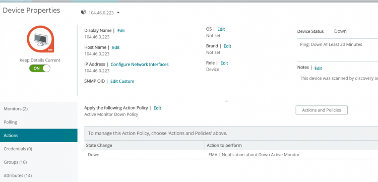
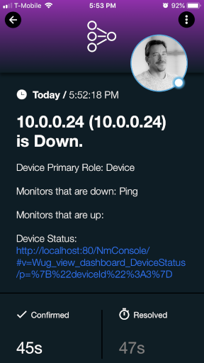

# SIGNL4 Integration with WhatsUp Gold

In this example we will use WhatsUpGold to send an email to the SIGNL4 team alerting them of a device that is down.

SIGNL4 is a mobile alert notification app for powerful alerting, alert management and mobile assignment of work items. Get the app at [https://www.signl4.com](https://www.signl4.com).

## Perequisites
- A SIGNL4 ([https://www.signl4.com](https://www.signl4.com)) account
- A WhatsUpGold ([https://www.whatsupgold.com/](https://www.whatsupgold.com/)) account

## How it works

First, let’s set an action policy to an Active Monitor. From Settings > Actions & Alerts > Actions and Policies.

Under Action Library, click on the + to expand the list of choices and select Email Action.

On the configuration tab input the name and all necessary information to connect to your SMTP server and your SIGNL4 email address.

The email action that we just set needs to be applied to a policy. Under Action Policies click on the + to create a new one.

Add the action we just created to the policy.

Now we need to assign the policy to a device. From My Network, choose a device you want to monitor and right click and select Device Properties.

Select Actions and assign the Action we created earlier.

The next time that this device goes down we will then receive an emailed notification.  SIGNL4 will receive this and alert on-call duty members, persistently notifying them that the alert has been raised and if no action is taken, the alert will then be escalated to a manager.

