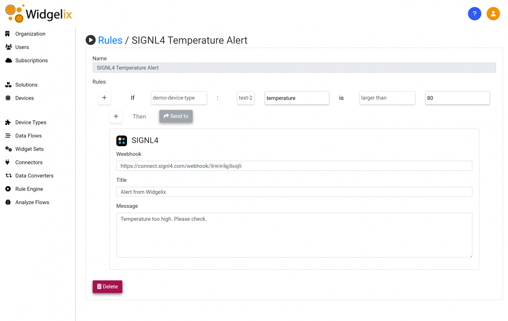

# SIGNL4 Integration with Widgelix

[GreenMesh](https://greenmesh.org/widgelix/) [Widgelix](https://widgelix.com/) is a cloud-based IoT platform that helps you to manage and control devices. Collect, analyze and visualize data from various devices, systems or protocols.

Mobile workers are not able to sit in front of a dashboard and actively monitor problems. SIGNL4 enables Widglelix to notify the mobile teams in the field or on call in real-time. This speeds up their response significantly and frees resources in the operations.

SIGNL4 is natively integrated in Widgelix. You can configure it in the Rule Engine.



In the Widgelix portal go to the Rule Engine. Here you specify the rule’s conditions and choose SIGNL4 under "Send to".

Under "Webhook" enter your SIGNL4 webhook URL including team secet.

```
https://connect.signl4.com/webhook/{team-secret}
```

Here, {team-secret} is your SIGNL4 team secret.

Specify a "Title" and a "Message" and that’s it. Now your SIGNL4 team gets notified when the rule applies.

The alert in SIGNL4 might look like this.


