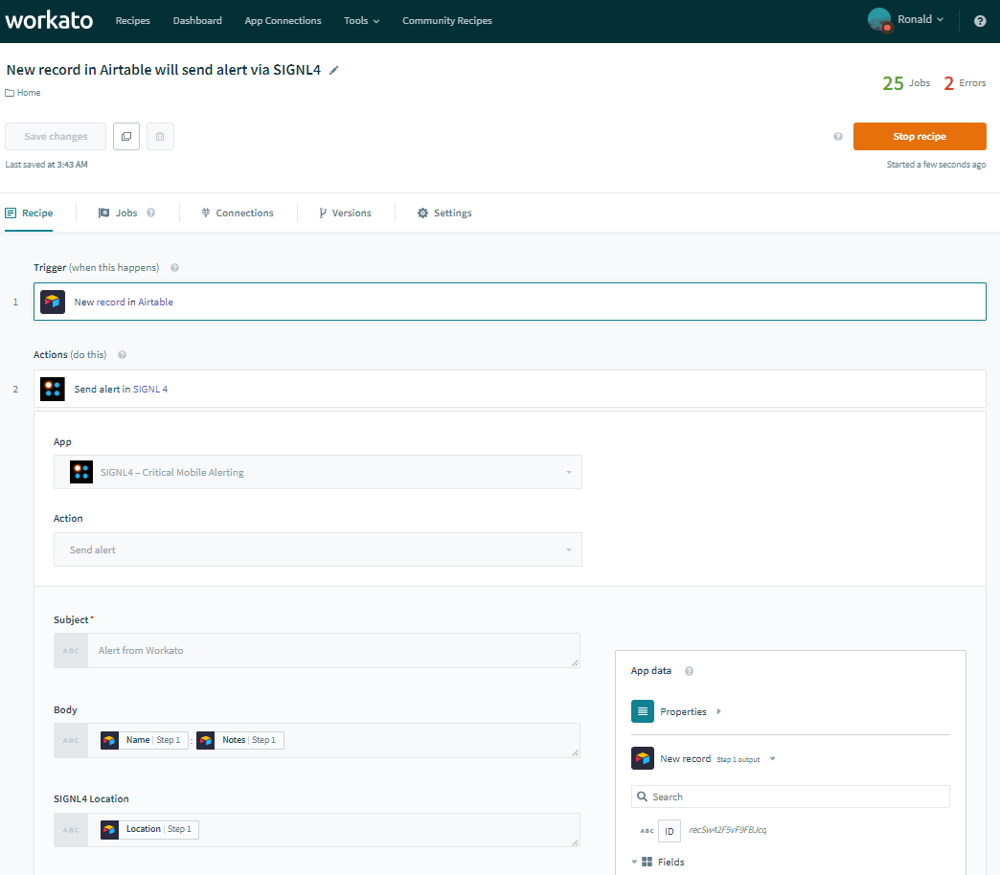
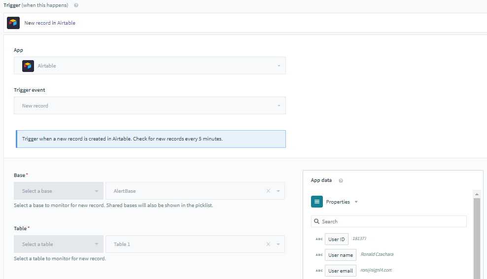
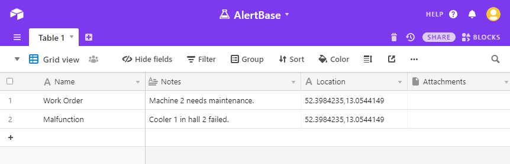
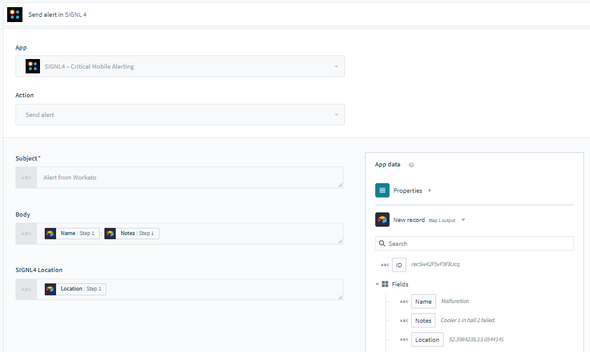

# SIGNL4 Integration with Workato

[Workato](https://workato.com/) is a single platform to integrate anything and automate everything including IT, sales, marketing, finance, support, etc. Various triggers and actions allow you to assemble your own workflows quickly and conveniently. Workato helps developers with time-consuming integration and maintenance tasks. Pairing this powerful platform with SIGNL4 can enhance your daily operations with an extension to your team wherever it is.

SIGNL4 is a mobile alert notification app for powerful alerting, alert management and mobile assignment of work items. Get the app at [https://www.signl4.com](https://www.signl4.com).

In the recipe below we send information from Airtable to SIGNL4. For example, this can be a service request or work order.

## Prerequisites
- A SIGNL4 ([https://www.signl4.com](https://www.signl4.com)) account
- A Workato ([https://www.workato.com](https://www.workato.com)) account
- An Airtable ([https://airtable.com](https://airtable.com)) account (optional for our example)

## How it works

In Workato you can create a new recipe with Airtable as a trigger.

The recipe is triggered each time when a new entry in Airtable is created.

As action you can now use the native SIGNL4 integration available here:  
[https://www.workato.com/custom_adapters/19391?token=cc186114](https://www.workato.com/custom_adapters/19391?token=cc186114)

You just need to configure your SIGNL4 team-secret and you can send static text as well as dynamic content from the previous steps.

Start the recipe and when the SIGNL4 action is executed, an alarm will be sent to your SIGNL4 team.

The alert in SIGNL4 might look like this.

