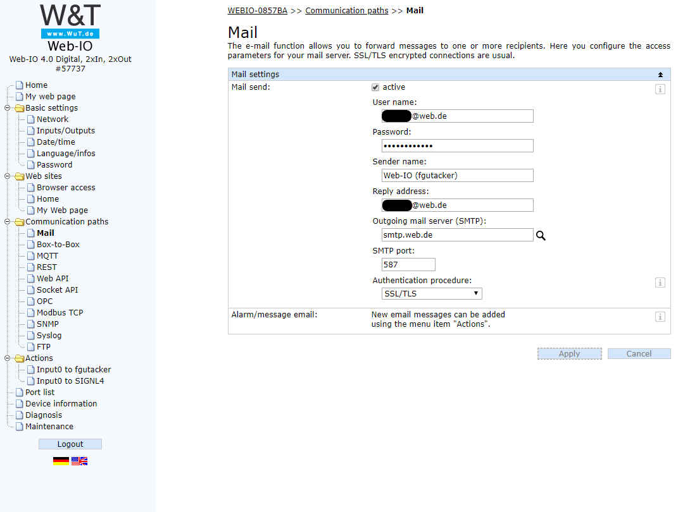

# SIGNL4 Integration with Web-IO from Wiesemann and Theis 

Machines, pumps, valves, fire alarm systems, temperature sensors, smoke detectors, etc. often do not offer IT integration. Instead, they provide simple analog cables or dry contacts. Monitoring these I/O states and detecting abnormal behavior or malfunctions is a common scenario in the IoT environment.

A robust industry device for this purpose is the “Web-IO 4.0 Digital, 2xIn, 2xOut” from Wiesemann & Theis GmbH in Wuppertal, Germany ([https://www.wut.de/e-57737-ww-daus-000.php](https://www.wut.de/e-57737-ww-daus-000.php)). In the following we describe the use of this device together with SIGNL4.

The small connector strip of the Web-IO device allows to monitor two inputs. If you want to monitor the switching states of contacts, you can optionally provide them with a 24 volt supply.

On-call teams responsible for business and operational continuity need to detect abnormal behavior so they can take immediate action. The availability of information on a dashboard is often not enough and can result in employees having to remove leave their actual workstation. Any critical information or warning needs to reach the appropriate employees immediately, no matter where they are.

This is where SIGNL4 comes in. The app-based alerting solution ensures that the right people receive actionable and enriched information at the right time and in any location.

The method we use here for the integration with SIGNL4 is email. It is necessary to enter the data of the SMTP server of SIGNL4 in the configuration of the Web-IO.



After this data has been entered, the email action can be set up. This area is also self-explanatory. You need to enter the email address of your SIGNL4 team (i.e. <team-secret@mail.sign4.com>) in the field "recipient email address".

Subject line and message text can be freely designed. Placeholders are used to mark the places where dynamic values will be entered later.

**Subject line**:  
```
Alert on <dn> at (<$y>-<$m>-<$d> <$h>:<$i>:<$s>)
```

**The message content looks like this**:  
```
System: "Sensor <dn>"
Time: "<$y>-<$m>-<$d> <$h>:<$i>:<$s>"
State: "<i1>"
```

With this formatting of the email, we ensure that SIGNL4 recognizes the individual values as dedicated parameters and visualizes them accordingly in the app as small tiles.

**The placeholders are the following values**:  
```
<i1> = Name of the first input channel
<c1> = Counter status of the first input channel
<dn> = Device name
<$y> = Year
<$m> = month
<$d> = day
<$h> = hour
<$i> = minute
<$s> = second
```

For more information, please refer to the manual of your Web-IO device.

These placeholders are replaced with the appropriate values before the message is sent. Since we used the format "label:value" in the message content, SIGNL4 will be recognizing the values and displaying them in the app.

The alert in SIGNL4 might look like this.


