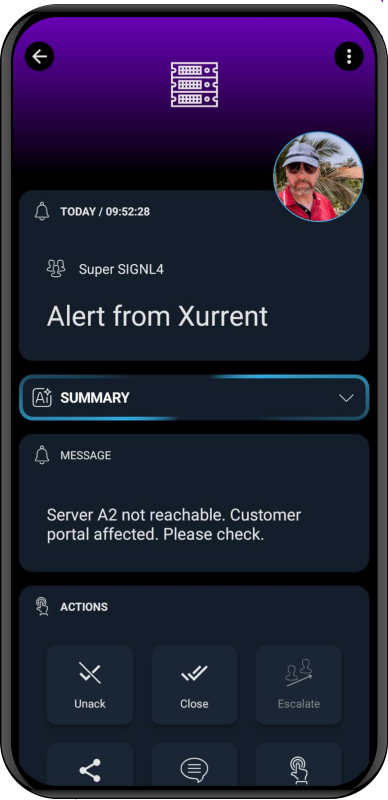

# SIGNL4 Integration with Xurrent

[Xurrent (formally 4me)](https://www.xurrent.com/) is an agile and future-proof IT service management (ITMS) solution that has all the ITSM capabilities you need and is fast to deploy and easy to use.

You can configure the Xurrent integration with SIGNL4 as follows.

## Connector App (Two-Way)

The Xurrent connector app makes 2-way integration with Xurrent a child's play and responding to service desk tickets can be done conveniently via the SIGNL4 mobile app.

Feature overview
- Forwarding tickets of your choice to SIGNL4
- Status synchronization between both systems
- Agent assignment when Signl is acknowledged and or closed
- Ticket notes on status changes in SIGNL4

## How does it work?

The connector communicates using the Xurrent REST API to read ticket details or to update them. An API user with according permissions must be used and created in Xurrent.

You can install and configure the integration in the SIGNL4 web portal under Integrations -> Gallery -> Xurrent.

You need to create your Xurrent Personal Access Token with access to Account, Me, Team, Note, Note reactions and Requests.

The alert in SIGNL4 might look like this.

