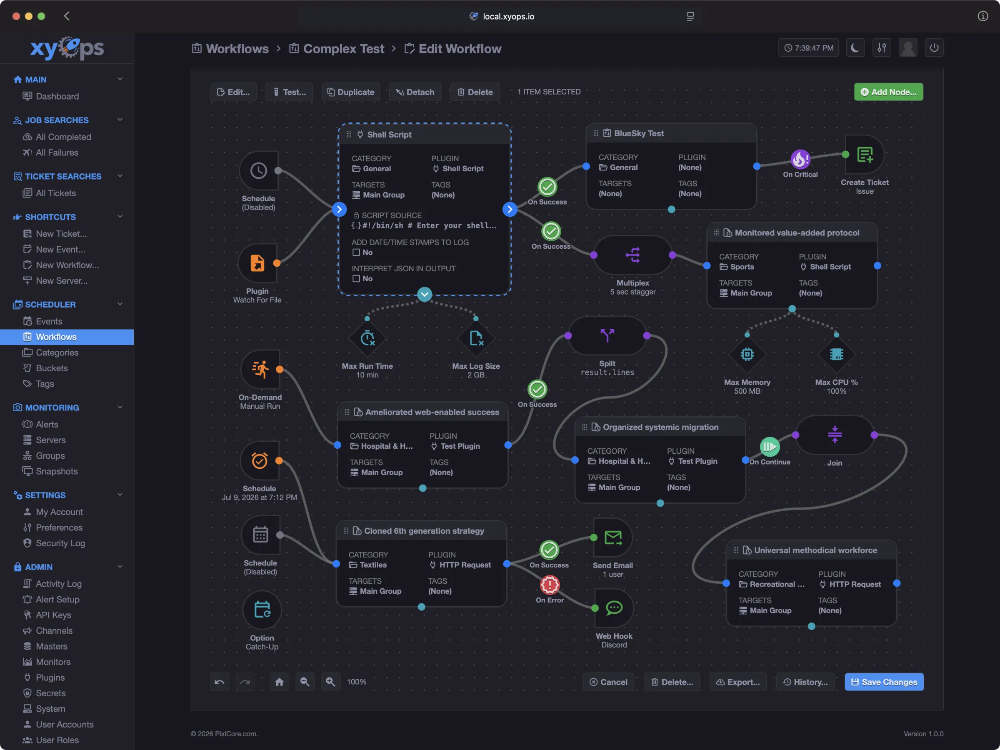
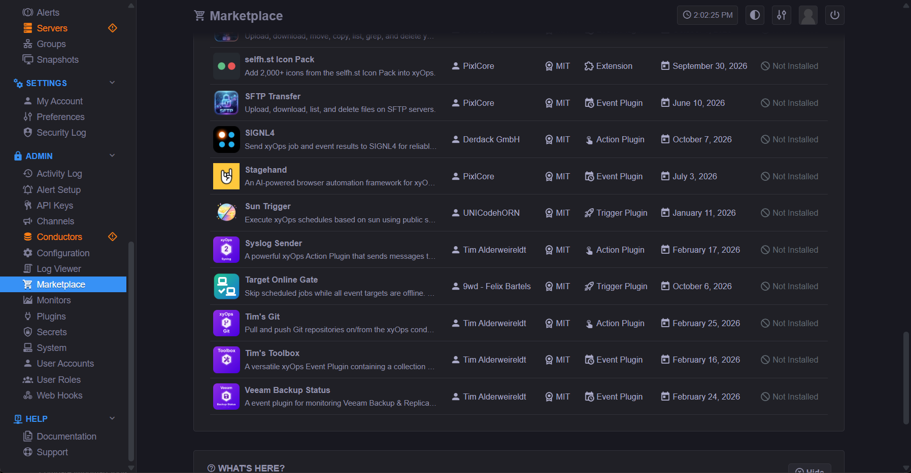
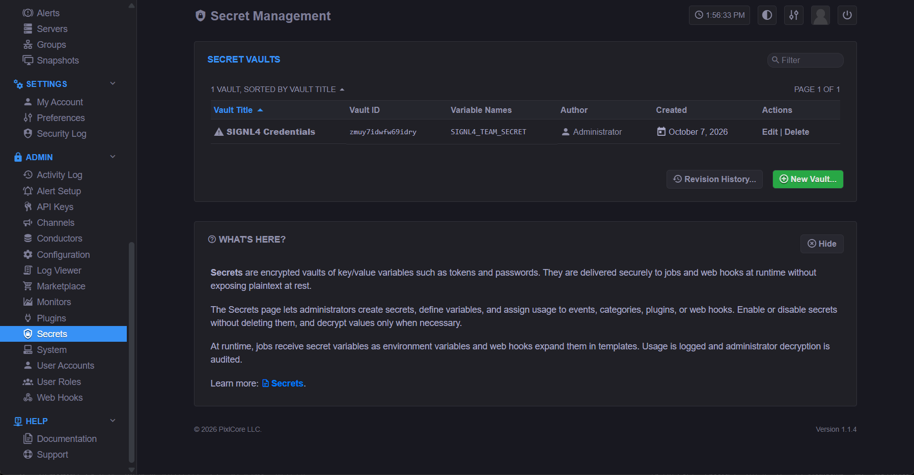
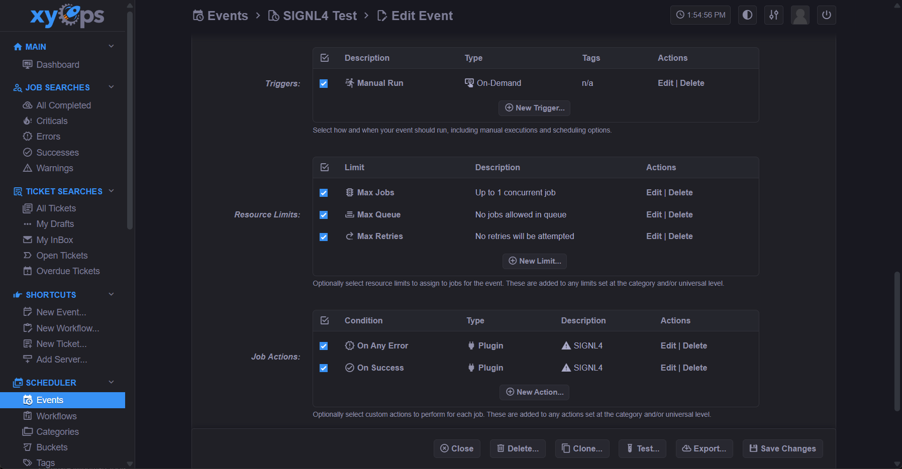
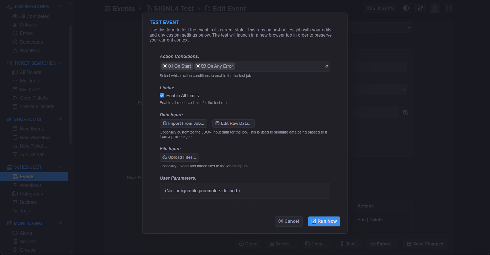
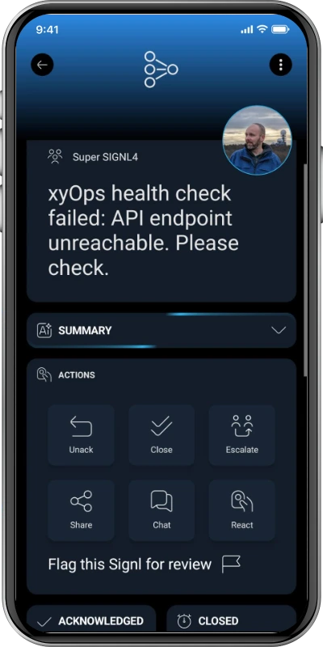

# SIGNL4 Integration with xyOps

[xyOps](https://xyops.io/) is an automation and operations platform for running jobs, workflows, monitoring tasks and operational processes.



SIGNL4 extends xyOps with reliable mobile alerting, including app push, SMS, voice calls, automated escalations, on-call scheduling and mobile incident response. Using the SIGNL4 Action Plugin, xyOps can notify the right people when jobs or events fail and automatically resolve corresponding SIGNL4 alerts when the same event returns to a successful state.

Some common use cases include:
- mobile alerting for failed xyOps jobs and workflows
- on-call notification for operational and IT teams
- automated escalation when critical jobs fail
- mobile incident response with acknowledgement and collaboration
- automatic alert resolution when an xyOps event succeeds again

## Prerequisites

- A [SIGNL4](https://www.signl4.com/) account
- A running [xyOps](https://xyops.io/) instance
- Access to the xyOps Marketplace or permission to install plugins

## How to Integrate

The easiest way to integrate xyOps with SIGNL4 is to install the SIGNL4 Action Plugin from the xyOps Marketplace.

Open the **Marketplace** in xyOps, search for **SIGNL4**, and install the plugin.



The plugin runs as an xyOps Action Plugin and sends event and job information to SIGNL4 via webhook.

If you install the plugin manually, it can also be executed using:

```text
npx -y github:signl4/xyplug-signl4#v1.0.0
```

The source code is available at [GitHub](https://github.com/signl4/xyplug-signl4).

## Configure the SIGNL4 Secret

The plugin needs your SIGNL4 team or integration secret.

In xyOps, create a **Secret Vault** and add the following variable:

```text
SIGNL4_TEAM_SECRET
```

Set its value to the SIGNL4 team or integration secret and grant the SIGNL4 plugin access to the vault.



The secret is used to send events to your SIGNL4 webhook endpoint:

```text
https://connect.signl4.com/webhook/{team-secret}
```

## Configure Alerting and Resolution

For correlated alerting, configure two SIGNL4 actions for the same xyOps event:

```text
On Error   → SIGNL4
On Success → SIGNL4
```



When the xyOps event fails, the plugin sends:

```text
X-S4-Status: new
```

When the same xyOps event later succeeds, the plugin sends:

```text
X-S4-Status: resolved
```

The xyOps Event ID is used as `X-S4-ExternalID` whenever available. This allows SIGNL4 to correlate the error and recovery and automatically close the corresponding alert.

For example:

```text
Error
Event ID: emuy8rid94wmygqk
X-S4-ExternalID: emuy8rid94wmygqk
X-S4-Status: new

        ↓

Success
Event ID: emuy8rid94wmygqk
X-S4-ExternalID: emuy8rid94wmygqk
X-S4-Status: resolved
```

> **Note:** Do not use **On Complete** if you want automatic error/recovery correlation. In this case xyOps passes the condition as `complete` regardless of whether the underlying execution succeeded or failed.

## Optional Parameters

The plugin supports the following optional parameters:

- `title` – custom alert title
- `message` – custom alert message
- `service` – optional SIGNL4 service / category
- `location` – optional location, for example `52.5200,13.4050`
- `resolveOnClear` – controls automatic resolution for clear/success conditions

If no custom title or message is configured, the plugin uses available xyOps event, alert or job information.

## Test the Integration

A convenient way to test the integration is with the xyOps **Test Plugin**.

Configure the SIGNL4 Action Plugin for both **On Error** and **On Success**.

First simulate an error. A new SIGNL4 alert should be created.

Then simulate success for the same xyOps event. The corresponding SIGNL4 alert should be resolved automatically.



That's it.

The alert in SIGNL4 might look like this.


