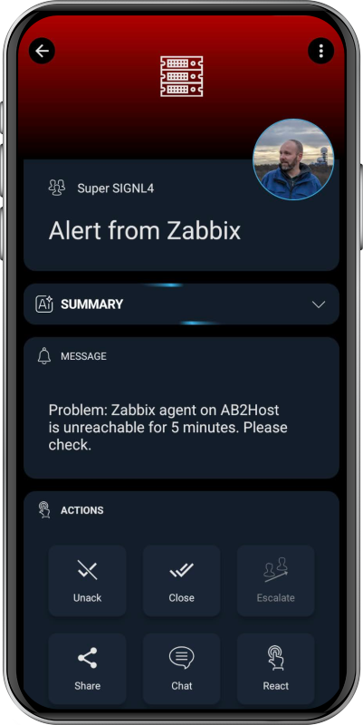

# SIGNL4 Integration with Zabbix

When critical systems fail, SIGNL4 is the fastest way to alert your staff, engineers, IT admins on call and “in the field”. SIGNL4 provides reliable notifications via mobile app push, text and voice calls with tracking, escalations and duty scheduling. Discover how to integrate with [Zabbix](https://www.zabbix.com/integrations/signl4#signl4) 5.0.

Mobile workers are not able to sit in front of a [Zabbix](https://www.zabbix.com/) dashboard and actively monitor problems. SIGNL4 enables Zabbix to notify the mobile teams in the field or on call in real-time. This speeds up their response significantly and frees resources in the operations.

Pairing Zabbix with SIGNL4 can enhance your daily operations with an extension to your team wherever it is. The two-way integration allows service engineers or IT administrators not only to receive alerts but also to acknowledge, annotate and close alerts, no matter where they are.

## How does it work?

For triggering and resolving SIGNL4 alerts you can use the built in SIGNL4 media type in Zabbix.

### SIGNL4 media type

In the Zabbix web portal go to Alerts -> Media types. Open the configuration of the SIGNL4 media type and make sure the Enabled field is checked.

If you do not see the SIGNL4 media type here or if you want to make sure to use the latest version you can go to [https://github.com/signl4/signl4-integration-zabbix](https://github.com/signl4/signl4-integration-zabbix) and download the file signl4-mediatype.yaml from there. You then import this media type in Zabbix.

### Add a user

In Zabbix you add a user for SIGNL4. In the Zabbix web portal you go to Users and create a new user for SIGNL4. For this user under Media you select SIGNL4 as Type and enter your SIGNL4 team or integration secret under Send to. The rest you can configure to suite your needs.


### Create your action

Now you can create your action in the Zabbix web portal under Alerts -> Actions. Choose the appropriate conditions and select the SIGNL4 user from the previous step as user to be alerted in the operation under Send to users.

### Test the alerting

Zabbix provides a very simple way to test alerting using certain media types. In the Zabbix web portal go to Alerts -> Media types. Find the SIGNL4 media type and in the right-hand side you see Test. Click Test and a text dialog opens. Here you enter your SIGNL4 team or integration secret in the field teamsecret and click Test. You then receive an alert on your SIGNL4 mobile app.


Here is a video showing this integration:

<iframe width="560" height="315" src="https://www.youtube-nocookie.com/embed/oryARdRV2es?si=zlcrqfT_6V3XklZG" title="YouTube video player" frameborder="0" allow="accelerometer; autoplay; clipboard-write; encrypted-media; gyroscope; picture-in-picture; web-share" allowfullscreen></iframe>

Since Zabbix 5.0 SIGNL4 is an integral part of Zabbix and available as a Media Type for Alerting. SIGNL4 can also be added as Media Type for previous Zabbix versions. The SIGNL4 Media Type allows you to forward problems from Zabbix to a SIGNL4 team.

## Two-Way Integration

With SIGNL4 it is also possible to acknowledge, annotate and close alerts directly from the SIGNL4 app. To forward this information back to Zabbix, you need to configure the Zabbix connector in your SIGNL4 portal under Integrations -> Gallery -> Zabbix (<-).

With Zabbix 6.4 and higher the authentication method has changed. With SIGNL4 you need to use the Zabbix API Token instead of username and password. You can obtain the Zabbix API token as described [here](https://www.zabbix.com/documentation/current/en/manual/web_interface/frontend_sections/users/api_tokens). Please note that in this case the Apache Web server on Zabbix side needs to pass the Authorization header. If this should not be the case you can check this discussion [here](https://www.zabbix.com/forum/zabbix-troubleshooting-and-problems/465800-python-api-modules-not-working-with-6-4).

For older Zabbix versions SIGNL4 provides a dedicated integration for Zabbix [here](https://www.zabbix.com/integrations/signl4). You can also find the integration scripts on [GitHub](https://github.com/signl4/signl4-integration-zabbix). Just go ahead, download the respective alert scripts from there and follow the instructions on the page.

### Testing Two-Way Integration

In order to use the two-way integration for status updates from SIGNL4 to Zabbix your Zabbix server needs to be reachable from the public Internet with a valid and publicly trusted (not self-signed) certificate.

To test the connection, you can use the following command.

```
curl -XPOST -H 'Content-Type: application/json-rpc' -d '{"jsonrpc":"2.0","method":"apiinfo.version","id":1,"auth":null,"params":{}}' https://your-zabbix-server/zabbix/api_jsonrpc.php
```

The command should return some JSON data.

The alert in SIGNL4 might look like this.


