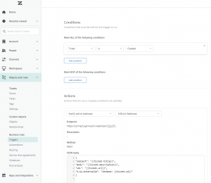

# SIGNL4 Integration with Zendesk

## SIGNL4 app for Zendesk

You can install the SIGNL4 app from the Zendesk Marketplace. During the installation you need to enter your SIGNL4 team secret and then you are ready to go.

Now your SIGNL4 team receives alerts whenever a new ticket is created. You can also send alerts to your team manually.

## Two-way integration

For two-way communication there is a Zendesk connector app available in SIGNL4 under Apps -> Zendesk. This connector app adds two-way functionality to SIGNL4 alerting in Zendesk. It allows you to acknowledge, close or annotate Zendesk tickets directly from within your SIGNL4 app.

In order to use the Connector you need to make sure you have SIGNL4 alerting activated in Zendesk. The configuration of the Zendesk connector app is straightforward. You just need the Zendesk username, password and the URL to your Zendesk instance. The user account needs to have the according access rights for the Zendesk API. Please, enable password access in the API settings (Admin -> API -> Settings -> Password access).

Attention: Tickets that are automatically created in Zendesk (e.g. via email or API) will not trigger the alert using the app. In this case you can use a webhook as described [here](https://support.zendesk.com/hc/en-us/articles/4408839108378-Creating-webhooks-to-interact-with-third-party-systems).

The URL is the webhook URL including team secret of your SIGNL4 team.

You can then create a trigger to send the notification.

The JSON body might look like follows:

{
"Subject": "{{ticket.title}}",
"Body": "{{ticket.description}}",
"URL": "{{ticket.url}}",
"X-S4-ExternalID": "Zendesk: {{ticket.id}}"
}

