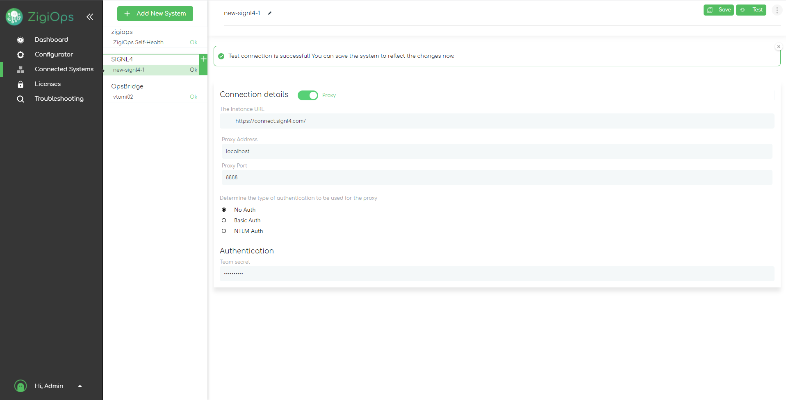
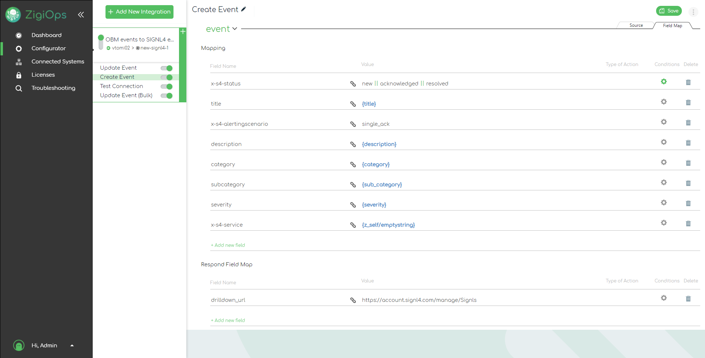

# SIGNL4 Integration with ZigiOps

SIGNL4 is a mobile alert notification app for powerful alerting, alert management and mobile assignment of work items. Get the app at [https://www.signl4.com](https://www.signl4.com).

In the example below we will be looking at how you can automatically transfer events from Micro Focus OpsBridge to SIGNL4 with ZigiOps.

## Prerequisites:
- A SIGNL4 ([https://www.signl4.com](https://www.signl4.com)) account
- A ZigiOps instance ([https://zigiwave.com](https://zigiwave.com))
- A Micro Focus OpsBridge instance ([https://microfocus.com](https://microfocus.com), optional)

1. Log-in to ZigiOps and check the connection with your SIGNL4 and OpsBridge instances. For the SIGNL4 configuration you just need to enter your SIGNL4 team secret.

2. Load the SIGNL4 – OpsBridge events template from our library or create an integration from scratch. Modify the data mapping and filtering per your needs.

3. To test, launch the integration and when an event is created in OpsBridge, it will automatically be transferred to your SIGNL4 instance where an alert is sent to your team.

You can find more information about the [SIGNL4 Connector](https://zigiwave.com/signl4-integrations/?utm_source=newsletter&utm_medium=mail&utm_campaign=signl4&utm_id=newsletter-signl4) and about the [integration with OpsBridge](https://www.zigiwave.com/integrations/signl4-opsbridge-integration) directly at the ZigiWave web site.

The alert in SIGNL4 might look like this.

