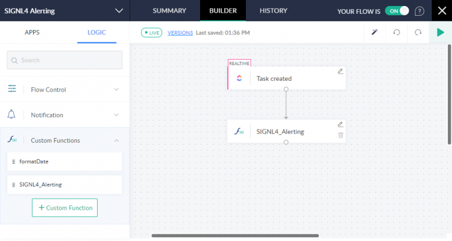
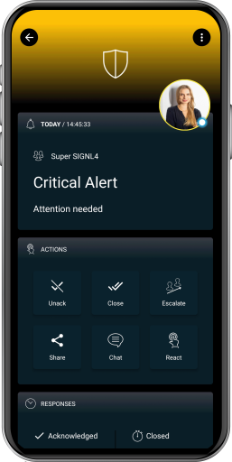

# SIGNL4 Integration with Soho Flow

When critical events happen, SIGNL4 is the fastest way to alert your staff, engineers, or other teams on call and “in the field”. SIGNL4 provides reliable notifications via mobile app push, text and voice calls with tracking, escalations and duty scheduling.

[Zoho Flow](https://www.zoho.com/flow/) helps you to automate your business workflows by connecting your apps. You can build smart integrations to break the information silos in your business.

Pairing Zoho Flow with SIGNL4 can enhance your daily operations with an extension to your team wherever it is. The integration allows you to know when a critical issue has occurred.

The integration of Zoho Flow and SIGNL4 is done using a custom function. In our example we send task information from a ClickUp to our SIGNL4 team.



Of course, also several other scenarios can be realized using the available apps in Zoho Flow.

## Prerequisites

- A SIGNL4 account (https://www.signl4.com)
- A Zoho Flow account (https://www.zoho.com/flow)

## Create Flow

In the Builder of Zoho Flow you can create a new flow. In our case we use the ClickUp app to trigger the flow when a new task is created in ClickUp. However, you can use any app that is suitable for you, e.g. Zoho CRM, Google Drive, etc.

## Custom Function

Now you create a custom function (Logic -> Custom Functions). You just need to copy / paste the code below into your function.

```javascript
string SIGNL4_Alerting(string teamsecret, string Title, string Message, string s4Service, string s4Location, string s4AlertingScenario, bool s4Filtering, string s4ExternalID, string s4Status)
{
// Supply the URL and parameters to the invoke URL task
data = Map();
// Alert title
data.put("Title",Title);
// Alert message
data.put("Message",Message);
// X-S4-Service: Assigns the alert to the service/system category with the specified name.
data.put("X-S4-Service",s4Service);
// X-S4-Location: Transmit location information ('latitude, longitude') with your event and display a map in the mobile app.
data.put("X-S4-Location",s4Location);
// X-S4-AlertingScenario: Pass 'single_ack' if only one person needs to confirm this alert. Pass 'multi_ack' in case this alert must be confirmed by the number of people who are on duty at the time this alert is raised.
data.put("X-S4-AlertingScenario",s4AlertingScenario);
// X-S4-Filtering: Specify a boolean value of true or false to apply event filtering for this event, or not. If set to true, the event will only trigger a notification to the team, if it contains at least one keyword from one of your services and system categories (i.e. it is whitelisted).
data.put("X-S4-Filtering",s4Filtering);
// X-S4-ExternalID: If the event originates from a record in a 3rd party system, use this parameter to pass the unique ID of that record. That ID will be communicated in outbound webhook notifications from SIGNL4, which is great for correlation/synchronization of that record with the alert.
data.put("X-S4-ExternalID",s4ExternalID);
// X-S4-Status: If you want to resolve an existing alert by an external id (X-S4-ExternalID), you can add this status parameter. It has two possible values: 'new' and 'resolved'. Sending an event with the status 'new' will create a new alert. If you want to resolve a alert, make sure to set the X-S4-Status to 'resolved' and provide an external ID via the 'X-S4-ExternalID' parameter for the alert(s) you want to resolve. It is only possible to resolve a alert with a provided external id that initially triggered it. If you set the status to any other value the event will be discarded. This means no alert will trigger from it.
data.put("X-S4-Status",s4Status);
headers = Map();
headers.put("Content-Type","application/json");
response = invokeurl
[
	url :"https://connect.signl4.com/webhook/" + teamsecret
	type :POST
	parameters:data
	headers:headers
];
return response;
}
```

Once you have saved the function you can insert it into your flow and use it. The parameter teamsecret ist your SIGNL4 team secret.

That is it and now you can test the alert. In our case we create a new task in ClickUp that triggers the flow. You should then receive an alert in your SIGNL4 app.

The alert in SIGNL4 might look like this.


