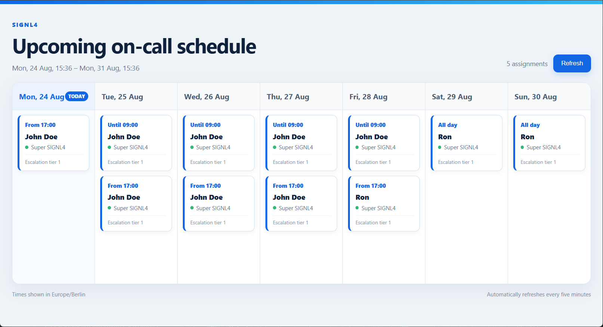

# Vibe Coding with the SIGNL4 REST API

The [SIGNL4 REST API v3](https://connect.signl4.com/api/docs/#signl4-api-v3) lets you build custom applications and automations for alerting, incident management, users, teams, and on-call scheduling.

If you are looking for pure alerting please consider using the [SIGNL4 webhook API](https://docs.signl4.com/integrations/webhook/webhook.html).

Using an AI coding assistant, you can quickly adapt the examples below to your own requirements—even without extensive programming experience.

## Writing an effective first Prompt

Start by telling the AI assistant what you want to build, which API version and programming language it should use, and how the result should be presented. For example: “Using the SIGNL4 REST API v3, create a Node.js application that displays who is on call during the next seven days. Use placeholders for the API key and optional team ID, handle API errors, and provide complete runnable code.”

You can use the following template for other projects:

> Using the SIGNL4 REST API v3, create a [language/application type] that [desired use case]. Retrieve [required data], filter it by [team, user, date, or status], and present the result as [web page, table, CSV file, or other format]. Use placeholders for credentials, handle possible API errors, and provide complete runnable code with brief setup instructions.

## Requirements

- A SIGNL4 account
- A SIGNL4 API key
- Node.js 18 or later
- An AI coding assistant such as ChatGPT, Codex, Antigravity or GitHub Copilot

You can create an API key in the SIGNL4 web portal under **Integrations → API Keys**.

## Examples

The following sections provides several examples.

### Custom Who-is-On-Call Information

Retreive who-is-on-call information from your SIGNL4 teams.



Download one of the following examples from our [GitHub repository](https://github.com/signl4/REST-API-and-AI-Vide-Coding).

- who-is-on-call.js
- who-is-on-call-web.js

Open the downloaded file and replace the API key placeholder:

```javascript
const API_KEY = "SIGNL4_API_KEY";
const TEAM_ID = ""; // Optional SIGNL4 team ID
```

For example:

```javascript
const API_KEY = "your-signl4-api-key";
const TEAM_ID = "your-signl4-team-id";
```

Leave `TEAM_ID` empty to retrieve information for all accessible teams.

Run the command-line example with:

```powershell
node .\who-is-on-call.js
```

Run the web calendar with:

```powershell
node .\who-is-on-call-web.js
```

Then open the displayed address, for example:

```text
http://127.0.0.1:3001
```

If port 3001 is already in use, select another port in the script or set the `PORT` environment variable.

## Customize the examples with AI

Upload the sample file to your AI coding assistant or paste its contents into the conversation. Then describe the required changes in plain language.

Example prompts:

- “Only show the schedule for the Production team.”
- “Show the next 14 days instead of seven days.”
- “Add a team selector to the web page.”
- “Highlight shifts starting within the next two hours.”
- “Export the on-call schedule as a CSV file.”
- “Display user email addresses in addition to names.”
- “Add our company logo and use our corporate colors.”
- “Create a mobile-friendly view showing only today’s on-call users.”
- “Check whether every team has someone on call and display a warning otherwise.”

When adding new functionality, provide the AI assistant with a link to the [SIGNL4 REST API v3 documentation](https://connect.signl4.com/api/docs/#signl4-api-v3). Ask it to use only documented v3 endpoints and fields.

## Additional use cases

The SIGNL4 REST API can be used for various custom applications and workflows:

- **Who is on call?** – Display the currently responsible users on an intranet or service portal.
- **Upcoming schedule** – Show planned on-call assignments for the next days or weeks.
- **Coverage check** – Detect teams that do not have an on-call user assigned.
- **Schedule export** – Export duty schedules to CSV, Excel, or another calendar.
- **On-call lookup** – Find the responsible person for a selected team.
- **Custom alert dashboard** – Display active alerts and their current status.
- **Incident reporting** – Retrieve alert information for reporting and analysis.
- **External schedule synchronization** – Synchronize duties with HR, workforce-management, or calendar systems.
- **User and team synchronization** – Connect SIGNL4 with another user-management system.
- **Custom alert actions** – Acknowledge, close, or annotate alerts from another application.

## Security

Do not share a real API key with an AI assistant or include it in screenshots, public repositories, or public web pages.

The web example calls the SIGNL4 API from the Node.js server. The API key must never be included in browser-side JavaScript. For production use, storing the API key in an environment variable or secure secrets store is recommended.

AI-generated code should always be reviewed and tested before it is used in a production environment.
